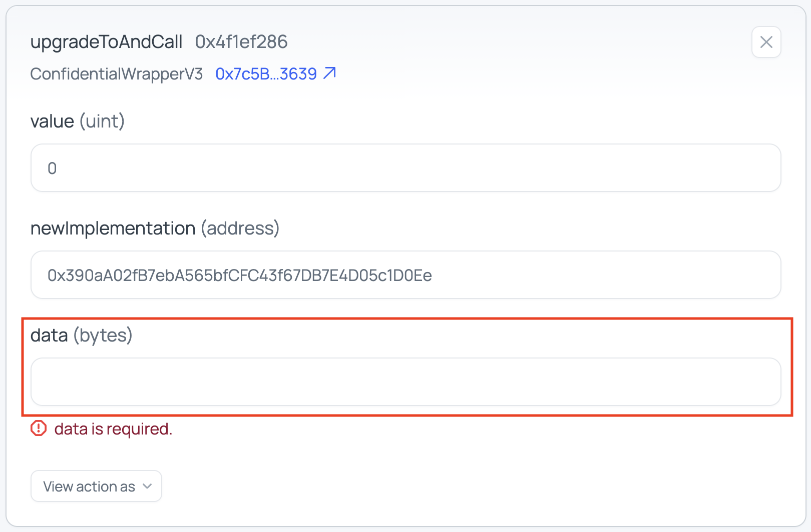

# Confidential Wrapper deployment

> ⚠️ **Temporary workaround required for fresh deployments.** The current audited contract source cannot be deployed directly as V3 in a fresh deployment. Until this is fixed in V4, fresh deployments must follow the temporary workaround: deploy V1 from a pinned commit, then upgrade to V3 and register the wrapper in a single DAO proposal. See [`temp-wrapper-deployment-workaround.md`](./temp-wrapper-deployment-workaround.md) before using Option 1 below.

> The Protocol Apps team deploys **ConfidentialWrapper** UUPS proxy contracts that wrap standard ERC-20 tokens into confidential ERC-7984 tokens using FHE. After deployment and Etherscan verification the Protocol DAO registers each wrapper in the **ConfidentialTokenWrappersRegistry**. The DAO is the only entity that can register or revoke wrappers in the registry.

---

## Requirements

Before starting, collect the following for each wrapper being deployed:

| Input | Where to get it |
| --- | --- |
| Underlying ERC-20 address | Token issuer / public documentation |
| Owner address for target chain (Protocol DAO) | [Addresses directory](https://github.com/zama-ai/protocol-apps/tree/main/docs/addresses) |
| Denylist function selector (`bytes4`) | Underlying token contract ABI. Use `0x00000000` and `false` if the underlying has no denylist |
| Initial blocked-users list (JSON array) | Compliance / legal. Use `'[]'` if none |
| Contract URI JSON metadata | Follow the pattern `data:application/json;utf8,{"name":"...","symbol":"...","description":"..."}` |
| `MNEMONIC` or `PRIVATE_KEY` for the deployer | DFNS / internal secrets |
| `ETHERSCAN_API_KEY` | Etherscan dashboard |
| RPC URL for the target network | Infura / Alchemy / internal node / public endpoint |

---

## What gets deployed

| Contract | Kind | Description |
| --- | --- | --- |
| `ConfidentialWrapper` (implementation) | Logic contract | One implementation is shared across all wrapper proxies. Deployed once per contract version. |
| `ConfidentialWrapper` (UUPS proxy) | Proxy contract | One proxy per wrapped token |

Within a batch run, all proxies share the same implementation. The deploy task reuses the existing implementation recorded in the OpenZeppelin `.openzeppelin/<network>.json` manifest and only deploys a new one when none is registered.

---

## Ownership

> **Important:** Initial owner must be the **Protocol DAO** for the target chain, not the deployer. Otherwise governance proposals will fail at execution; correcting ownership requires an additional proposal for the DAO to `acceptOwnership` (`Ownable2StepUpgradeable`).

| Entity | Role |
| --- | --- |
| Protocol DAO | Owner of each deployed wrapper contract and the Wrappers Registry |

---

## Mainnet key addresses

| Name | Address |
| --- | --- |
| Protocol DAO | `0xB6D69D5F334d8B97B194617B53c6aB62f8681Ef3` |
| Wrappers Registry | `0xeb5015fF021DB115aCe010f23F55C2591059bBA0` |

## Sepolia testnet key addresses

| Name | Address |
| --- | --- |
| Protocol DAO | `0x08e8a84c3c8c7cba165B1adcf67Ae4639eF84f52` |
| Wrappers Registry | `0x2f0750Bbb0A246059d80e94c454586a7F27a128e` |

---

Pick the option that matches your task:

- **Option 1 — Fresh wrapper contract deployment**: a new token is being wrapped for the first time. Deploys a proxy (and implementation, if none exists), verifies, then registers the wrapper.
- **Option 2 — Upgrade to a new implementation**: existing wrapper proxies need to point to a new implementation contract.

---

## Option 1 — Fresh wrapper contract deployment

> ⚠️ **Do not use as-is.** Fresh V3 deployments are blocked until V4 ships. Follow [`temp-wrapper-deployment-workaround.md`](./temp-wrapper-deployment-workaround.md) instead.

### Step 1 — Set up the environment

From the `contracts/confidential-wrapper` directory:

```bash
cp .env.example .env
npm install
npm run compile
```

Populate `.env` with all required values. For a batch of `N` wrappers (replace `N` with the actual integer count, and `{i}` with each index `0..N-1`):

```dotenv
# Auth
MNEMONIC=                          # or PRIVATE_KEY=
MAINNET_RPC_URL=
ETHERSCAN_API_KEY=

NUM_CONFIDENTIAL_WRAPPERS=N

# Repeat for each i in 0..N-1
CONFIDENTIAL_WRAPPER_NAME_{i}=
CONFIDENTIAL_WRAPPER_SYMBOL_{i}=
CONFIDENTIAL_WRAPPER_CONTRACT_URI_{i}=
CONFIDENTIAL_WRAPPER_UNDERLYING_ADDRESS_{i}=
# Ethereum mainnet DAO address
CONFIDENTIAL_WRAPPER_OWNER_ADDRESS_{i}="0xB6D69D5F334d8B97B194617B53c6aB62f8681Ef3"   
CONFIDENTIAL_WRAPPER_BLOCKED_USERS_{i}=          # JSON array, e.g. '[]'
CONFIDENTIAL_WRAPPER_UNDERLYING_DENY_LIST_SELECTOR_{i}=   # bytes4, e.g. 0xfe575a87
CONFIDENTIAL_WRAPPER_HAS_UNDERLYING_DENY_LIST_SELECTOR_{i}=  # true | false
```

### Step 2 — Deploy

**Batch (recommended when deploying multiple wrappers):**

```bash
npx hardhat task:deployAllConfidentialWrappers --network mainnet
```

**Single wrapper:**

> ⚠️ The values in the example below are taken from the existing Ethereum mainnet **cUSDT** wrapper at `0xAe0207C757Aa2B4019Ad96edD0092ddc63EF0c50` and are here for reference. Update them for the new wrapper you are deploying.

```bash
npx hardhat task:deployConfidentialWrapper \
  --name "Confidential USDT" \
  --symbol "cUSDT" \
  --contract-uri 'data:application/json;utf8,{"name":"Confidential USDT","symbol":"cUSDT","description":"Confidential wrapper of USDT"}' \
  --underlying 0xdAC17F958D2ee523a2206206994597C13D831ec7 \
  --owner 0xB6D69D5F334d8B97B194617B53c6aB62f8681Ef3 \
  --blocked-users '[]' \
  --underlying-deny-list-selector 0xfe575a87 \
  --has-underlying-deny-list-selector true \
  --network mainnet
```

On success, each wrapper prints:

```
✅ Deployed <Name> ConfidentialWrapper:
  - Confidential wrapper proxy address:  0x...
  - name: ...
  - symbol: ...
  ...
```

Record the proxy address for every wrapper.

### Step 3 — Verify on Etherscan

**Batch:**

```bash
npx hardhat task:verifyAllConfidentialWrappers --network mainnet
```

**Single:**

```bash
npx hardhat task:verifyConfidentialWrapper \
  --proxy-address <PROXY_ADDRESS> \
  --network mainnet
```

This verifies both the proxy contract and the implementation contract. Since all wrappers share the same implementation bytecode, the implementation source will already be verified from the second wrapper onward. Etherscan will report a duplicate-verification notice, which is expected.

### Step 4 — Register in the Wrappers Registry (DAO action)

The wrapper is not active until the Protocol DAO registers it. This is an onchain governance action and cannot be executed by the deployer.

Prepare and submit a DAO proposal that calls:

```solidity
registry.registerConfidentialToken(
    underlyingERC20Address,
    confidentialWrapperProxyAddress
);
```

See the [Creating Ethereum Proposals](../governance/creating-proposals-ethereum.md) guide for help on creating a new proposal.

### Step 5 — Update the addresses directory

Open a PR on `zama-ai/protocol-apps` with an entry for each new wrapper in the appropriate file in `protocol-apps/docs/addresses/{network}/{chain}` under "Confidential Wrappers":

```markdown
| Confidential TOKEN | `cTOKEN` | [`0x...`](https://etherscan.io/address/0x...) | [`0x...`](https://etherscan.io/token/0x...) |
```

---

## Option 2 — Upgrade to a new implementation

Upgrades are a two-phase process: the deployer deploys a new implementation contract; the DAO then executes `upgradeToAndCall` on each proxy via governance.

### Step 1 — Check for an existing implementation

Before deploying, confirm whether a matching implementation for this version already exists. Check:

- Existing wrapper deployments may have the implementation that you need already
- `.openzeppelin/<network>.json` for an entry matching the current source.
- `deployments/<network>/` for prior `ConfidentialWrapper_<label>_Impl` artifacts.
- (Optional) Etherscan to confirm the recorded implementation address is deployed and verified.

If a usable implementation already exists onchain, skip Steps 3 and 4 and reuse that address in the DAO proposal at Step 5.

### Step 2 — Run the upgrade test on a fork

**WIP -- Coming soon**

### Step 3 — Deploy the new implementation

Minimal `.env` required for this step:

```dotenv
MNEMONIC=                          # or PRIVATE_KEY=
MAINNET_RPC_URL=
ETHERSCAN_API_KEY=
```

Deploy the implementation contract:

```bash
npx hardhat task:deployConfidentialWrapperImpl --network mainnet
```

The implementation is saved as `ConfidentialWrapper_Impl` in the deployments artifacts. Record the implementation address printed on success.

### Step 4 — Verify the new implementation on Etherscan

```bash
npx hardhat task:verifyConfidentialWrapperImpl \
  --impl-address <IMPL_ADDRESS> \
  --network mainnet
```

### Step 5 — Submit the DAO upgrade proposal

Prepare a DAO proposal for each proxy that calls:

```solidity
proxy.upgradeToAndCall(newImplementationAddress, reinitializeCalldata);
```

`reinitializeCalldata` is the ABI-encoded call to the reinitializer function in the new implementation.

See the [Creating Ethereum Proposals](../governance/creating-proposals-ethereum.md) guide for help on creating a new proposal.


#### Getting calldata bytes

Use Foundry's `cast calldata` to ABI-encode the reinitializer call. Foundry must be installed. See the [Foundry docs](https://www.getfoundry.sh).

No blocked users, underlying has no denylist:

```bash
cast calldata "reinitializeV3(address[],bytes4,bool)" "[]" "0x00000000" false
```

With a blocked-users list and a denylist selector:

```bash
cast calldata "reinitializeV3(address[],bytes4,bool)" "[0xAddr1,0xAddr2]" "0xfe575a87" true
```

Paste the returned hex string as `data (bytes)` in the proposal:



**Alternatives** if Foundry is not available:
- [Ethers.js `Interface.encodeFunctionData`](https://docs.ethers.org/v6/api/abi/#Interface-encodeFunctionData) or [viem `encodeFunctionData`](https://viem.sh/docs/contract/encodeFunctionData) in a quick Node script.

---

## Verification checklist

After completing a deployment or upgrade, confirm each of the following:

- [ ] Proxy address is accessible on Etherscan and shows "Read as Proxy" / "Write as Proxy" tabs
- [ ] Proxy shows the correct new implementation address
- [ ] Implementation address is verified on Etherscan (source code visible)
- [ ] `name()` and `symbol()` return the expected values when called on the proxy
- [ ] `underlying()` returns the correct underlying address
- [ ] `owner()` returns the Protocol DAO address
- [ ] `isConfidentialTokenValid(proxyAddress)` returns `true` on the registry (post-registration)
