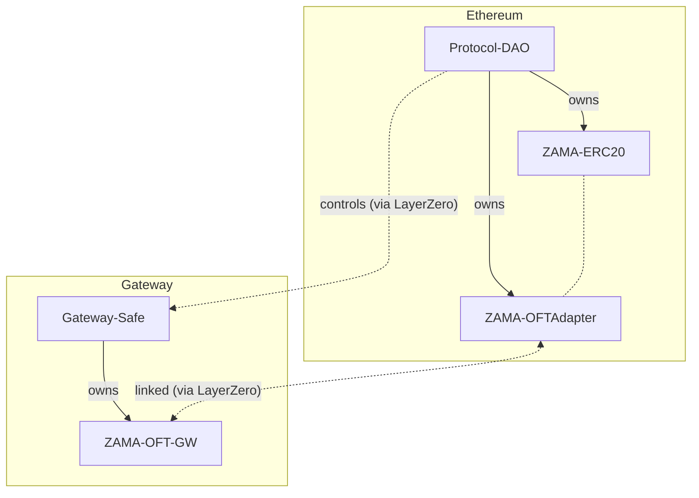

# Governance

Governance in the Zama protocol covers operation and adjustment of the protocol, including the $ZAMA token. Governance is decentralized and controlled by a set of operators that all have the same voting weight, independent of their staking amounts. The set of operators is itself changed by a governance proposal.

## Structure

The primary governance module is the [Zama Protocol Aragon DAO on Ethereum](https://app.aragon.org/dao/ethereum-mainnet/zama.dao.eth/) controlled by the operators. This means that proposals are voted onchain and (most of them) automatically executed.

There are furthermore secondary governance modules, in the form of local multisigs, deployed on every other chain involved in the protocol or token. They act as the owner of contracts on the given chain, and will be linked together with the primary governance module via LayerZero, allowing the latter to act on behalf of all of the secondary modules. This means that the Aragon DAO will be used for all governance under normal circumstances, and the local multisigs will only used as fallbacks in case there is an issue with the LayerZero link.

The diagram below shows this governance structure, and how it works for ownership in the case of the $ZAMA token.

## Operator wallets

Each operator maintains their own wallets for participating in the DAO and multisigs. Operators are free to choose how they instantiate their wallet but are strongly encouraged to use a hardware, MPC, or multisig wallet. Where possible, the same wallet may be used for multiple multisigs.

Linking operator identity to their wallets will eventually be handled onchain, but it for the moment is done via a secured GitHub repository.

## Proposals

Anyone may create governance proposals. However, in practice, we expect that Zama will typically do this. Proposals can be created using the Aragon App dashboard or by direct interaction with its contracts.

Once a proposal is created, every operator is expected to review it shortly afterwards, and act within the deadline set in the proposal. Verifying a proposal must be done independently and against information in the secured GitHub repository. Proposals will typically include actions for calling other contracts, and operators must independently verify these as well.

When proposals are accepted, anyone can execute them through the Aragon App. However, again we expect that Zama will typically do this.

## Actions

Below is an expected list of actions that will be taken by governance. For technical reasons we initially only use a single majority threshold (i.e. at least 1/2 of the operators), but we will be expanding with more soon for finer grained control. This is noted as "Initial threshold" and "Future threshold" in the table below. The following subsections gives details on each action.

Note that [pausing](pausing.md) is handled separately, and any operator can do this on their own.

| Action                           | Initial threshold | Future threshold | Execution |
| -------------------------------- | ----------------- | ---------------- | --------- |
| Update contracts                 | 1/2               | 2/3              | Onchain   |
| Update offchain services         | 1/2               | 2/3              | Depends   |
| Elect operators                  | 1/2               | 1/2              | Onchain   |
| Slash operators                  | 1/2               | 2/3              | Onchain   |
| Update the reward rate           | 1/2               | 1/2              | Onchain   |
| Update unstaking cooldown period | 1/2               | 2/3              | Onchain   |
| Unpausing                        | 1/2               | 1/2              | Onchain   |
| Address / contract blocking      | 1/2               | 1/6              | Onchain   |
| Address / contract unblocking    | 1/2               | 1/2              | Onchain   |
| LayerZero re-configuration       | 1/2               | 2/3              | Onchain   |
| Update cryptographic parameters  | 1/2               | 2/3              | None      |
| Resharing the FHE key            | 1/2               | 1/6              | Onchain   |
| Generating new FHE key           | 1/2               | 2/3              | Onchain   |

Note that _Update offchain services_ proposal may include some onchain actions to be executed, but may also simply be a consensus proposal on e.g. which version of an offchain service to use.

### Update contracts

New contract implementations are typically deployed by Zama, and a governance proposal is used to update the protocol to use them (i.e. updating proxies). Operators must verify that the new implementations match the specified release version.


**Some contracts cannot be upgraded**: $ZAMA token, operator staking contracts, pauser contracts


### Update offchain services

Some components allow version verification while other do not. When possible, these proposals will included the needed actions to verify versions of offchain services. In all cases must the operator verify that the version matches with the one discussed offchain.

### Elect operators

The set of operators is negotiated offchain, and made effective with a governance proposal. Operators must verify that the proposal updates all the relevant contracts and with the correct set of operator addresses.

### Slash operators

In the rare event than an operator is deviating from the desired behavior of the protocol, a governance proposal can be made to slash (part of) the stake of the operator. Details will be discussed offchain, resulting in a slashing amount. Operators must verify that the correct amount is used, and approve the proposal if they agree with the offense.

### Update the reward rate

The tokens per second rate is used by [protocol staking](staking.md) to mint rewards and fees. The value is negotiated offchain, and operator must verify that the correct value is used.

### Update unstaking cooldown period

Determines the unstaking delay for operators and token holders. The value is negotiated offchain, and operator must verify that the correct value is used. Low values risk making slashing less effective, and gives less time to find replacement operators if needed. Note that operator staking shares are transferable, so token holders have alternative means of “unstaking”.

### Unpausing

Used to unpause the protocol after it has been [paused](pausing.md). Negotiation of when it’s safe to unpause happens offchain by the incident team. Operators must be confident that it is safe to unpause before approving.

### Address / contract blocking

An address can be blocked on host chains if needed. The reasons for this will be discussed on Slack first, and a proposal created to execute.

### Address / contract unblocking

An address can be unblocked on host chains if needed. The reasons for this will be discussed on Slack first, and a proposal created to execute.

### LayerZero re-configuration

In rare cases, we may need to adjust the LayerZero configuration. Details of this will be discussed offchain, including the responsibility of operators. Operators must make sure to understand implication of changes before approving.

### Update cryptographic parameters

Occasionally we may need to update the cryptographic parameters of the protocol, including for the FHE scheme or the MPC threshold protocol. This includes tweaks that improves security and performance. Proposals will likely not include onchain actions, but rather serve as a consensus point, will follow-up software updates.

### Resharing the FHE key

The shares of the FHE secret key may need to be updated once in a while. Approval will trigger a Gateway request to the KMS nodes to execute a resharing.

### Generating new FHE key

The FHE key may need to be renewed once in a while. Approval will trigger a Gateway request to the KMS nodes to re-execute key generation.
