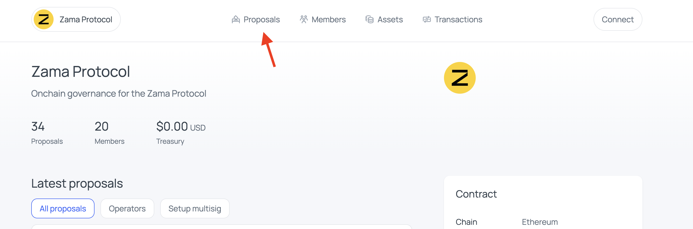
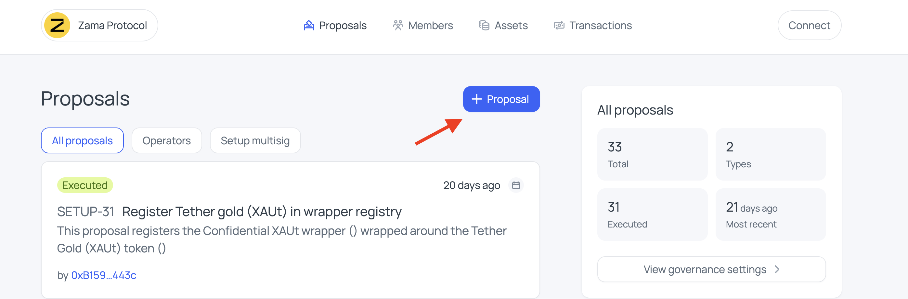
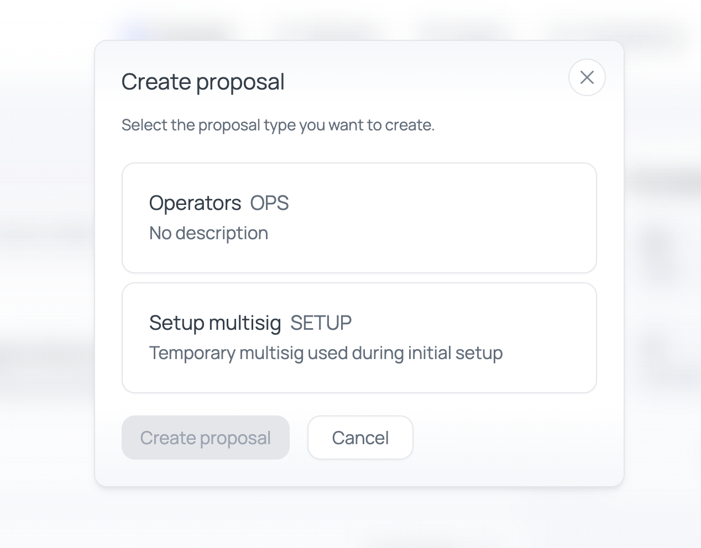
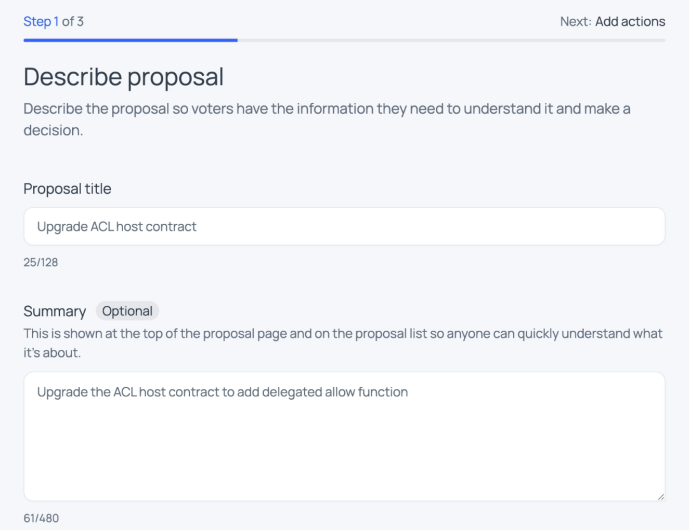
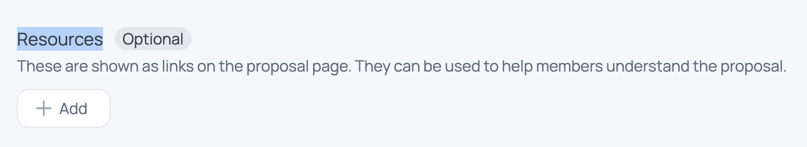
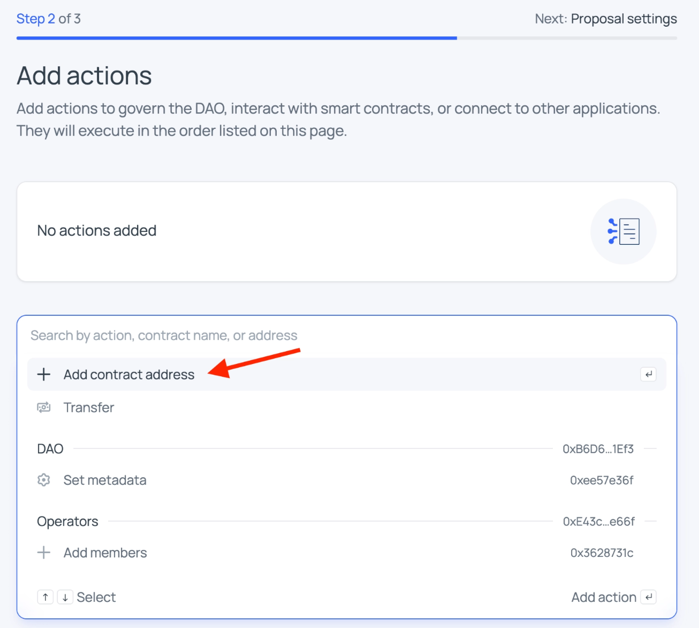
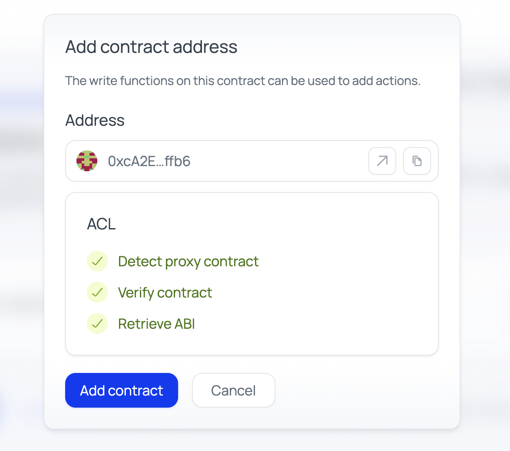
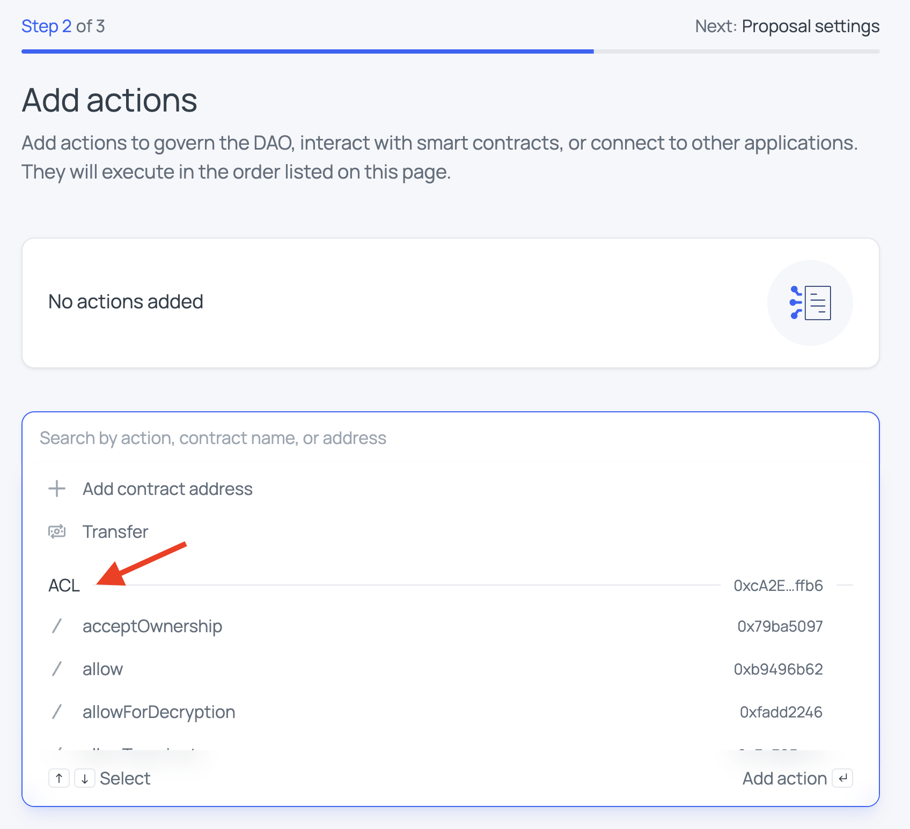
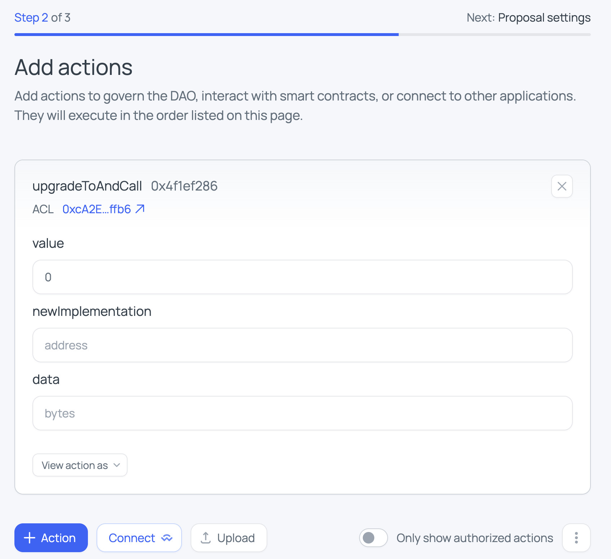
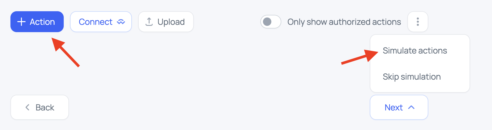

# Creating Ethereum Proposals

Proposals are created and voted on via the Aragon App UI:

- [Mainnet DAO](https://app.aragon.org/dao/ethereum-mainnet/zama.dao.eth/dashboard)
- [Testnet DAO](https://app.aragon.org/dao/ethereum-sepolia/0x08e8a84c3c8c7cba165B1adcf67Ae4639eF84f52/dashboard)
- [Devnet DAO](https://app.aragon.org/dao/ethereum-sepolia/0x41d84D9F00263eaF80f3526C157CD49c263CAd59/dashboard)

**Related guides:**
- [Creating cross-chain (remote) proposals](creating-proposals-remote.md): how to create and submit cross-chain proposals to EVM destinations
- [Reviewing proposals](reviewing-proposals.md): how to verify proposals before approving
- [CLI reference](cli-reference.md): detailed CLI tool documentation

---

## Step 0: Create a community forum post

Before creating the on-chain proposal, publish a post in the [governance community forum](https://community.zama.org/c/protocol/governance/) to present and add context on the proposal so DAO members can review it. Use the [forum post template](forum-post-template.md). Keep the post's URL — you'll link it in the proposal's **Resources** in Step 1.

## Step 1: Initialize the proposal

1. Open the Aragon DAO dashboard and click **Proposals**.

2. Click **+ Proposal**.

3. Select the proposal type:
   - **Operators**: requires 9/17 operator approvals.

4. Connect your wallet and fill in:
   - **Title**: short description of the proposal
   - **Summary**: one-line summary
   - **Body**: detailed description. Voters should be able to verify the proposal on their own or in the context of linked resources
   - **Resources**: links to help reviewers understand the proposal. Examples:
      - The [community forum post](https://community.zama.org/c/protocol/governance/)  created in Step 0
      - [protocol-registry repo](https://github.com/zama-ai/protocol-registry)

## Step 2: Add actions

1. Enter the target contract address and wait for all checks to turn green.
   - Exception: simple transfers or Aragon DAO–related actions are directly available.

2. Pick the function to call from the dropdown.

3. Fill in function arguments.

> **Warning:** ⚠️ Do not use quotes around string arguments (unlike Remix IDE).

4. To add more actions, click **+ Action**.

## Step 3: Simulate and submit

1. Click **Next**.
2. Click **Simulate** to verify actions won't revert on execution.

3. Submit the proposal and notify:
   - First code owners
   - Then DAO members
