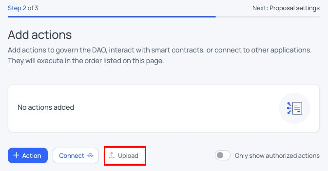
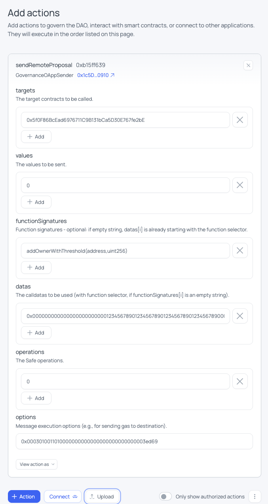

# Creating Cross-Chain Gateway Proposals

The Protocol DAO on Ethereum can execute governance actions on the Gateway chain. This works through:
- `GovernanceOAppSender` contract on Ethereum
- `GovernanceOAppReceiver` contract on Gateway
- Connected via LayerZero

On the Gateway, `GovernanceOAppReceiver` calls functions through the Gateway Safe. More information available in the [Governance](../governance.md) documentation.

**Related guides:**
- [Creating Ethereum proposals](creating-proposals-ethereum.md): how to create and submit Ethereum proposals
- [Reviewing proposals](reviewing-proposals.md): how to verify proposals before approving
- [CLI reference](cli-reference.md): detailed CLI tool documentation

---

## Step 0: Create a community forum post

Before creating the on-chain proposal, publish a post in the [governance community forum](https://community.zama.org/c/protocol/governance/) to present and add context on the proposal so DAO members can review it. Use the [forum post template](forum-post-template.md). Keep the post's URL — you'll link it in the proposal's **Resources** when filling in the proposal details (Step 5).

## One-time setup.

```bash
git clone https://github.com/zama-ai/protocol-apps.git
cd protocol-apps/scripts/governance-proposal-builder
npm install
cp .env.example .env
# Edit .env: set RPC_ETHEREUM to your RPC URL
```

> **Important:** It is recommended to use your own Ethereum RPC URL for the script

## Step 1: Start from a template

```bash
# Mainnet
cp gateway-proposal-temp.mainnet-example.json gateway-proposal-temp.json

# Testnet
cp gateway-proposal-temp.testnet-example.json gateway-proposal-temp.json
```

## Step 2: Describe the Gateway calls

Open `gateway-proposal-temp.json` and edit **only** these fields:

- `arguments.targets[i]`: contract address on Gateway
- `arguments.functionSignatures[i]`: human-readable signature of the function to call
- `arguments.datas[i]`: ABI-encoded arguments **without** the 4-byte selector

Duplicate the following fields (**but keep them "0"s**) to match the length of `targets`:
- `arguments.values`: array of `"0"`
- `arguments.operations`: array of `"0"`

**⚠️ Important: Do not modify:**
- `to`: must stay equal to the canonical `GovernanceOAppSender` for the network
- `method`: must stay `"sendRemoteProposal"`
- `arguments.options`: must stay `"0x"` (the script fills this)

Example:

```json
{
  "to": "0x1c5D750D18917064915901048cdFb2dB815e0910",
  "method": "sendRemoteProposal",
  "arguments": {
    "targets": ["0x5f0F86BcEad6976711C9B131bCa5D30E767fe2bE"],
    "values": ["0"],
    "functionSignatures": ["addOwnerWithThreshold(address,uint256)"],
    "datas": ["0x00000000000000000000000012345678901234567890123456789012345678900000000000000000000000000000000000000000000000000000000000000002"],
    "operations": ["0"],
    "options": "0x"
  }
}

```

## Step 3: Sanity-check each `datas[i]`

Decode each entry with `cast abi-decode` to verify it matches your intent. Example with the above values:

```bash
DATA=0x00000000000000000000000012345678901234567890123456789012345678900000000000000000000000000000000000000000000000000000000000000002
cast abi-decode 'f()(address,uint256)' "$DATA"
# Output:
# 0x1234567890123456789012345678901234567890
# 2
```
- `f()` is a fixed placeholder name: keep it as is.
- the parameter types after `f()` must match the ones from `functionSignatures[i]` (like here for `addOwnerWithThreshold(address,uint256)`).


## Step 4: Run the fill script

```bash
# Mainnet
npm run fill-options-gateway-proposal:mainnet

# Testnet
npm run fill-options-gateway-proposal:testnet
```

**Output files:**
- `aragonProposal.json`: upload this to the Aragon frontend
- `gateway-proposal-filled.json`: human-readable record with `options` populated

> **Important:** The script won't overwrite existing output files. Delete `gateway-proposal-filled.json` and `aragonProposal.json` before regenerating new ones.

## Step 5: Upload and submit the proposal

1. Step 1 is the same as in [Creating Ethereum Proposals](creating-proposals-ethereum.md#step-3-simulate-and-submit).

2. In the Aragon frontend, click the **Upload** button:



3. Select `aragonProposal.json`. The UI should decode the `sendRemoteProposal` call:



3. Same as in step 3 of [Creating Ethereum Proposals](creating-proposals-ethereum.md#step-3-simulate-and-submit): **simulate** the proposal, then submit. 


## Step 6: Upload the json files to the community forum

Upload the `aragonProposal.json` and `gateway-proposal-filled.json` files to the community forum post created in Step 0.
