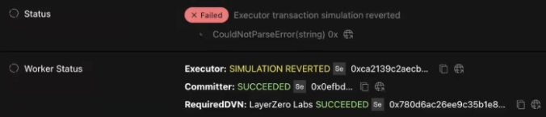
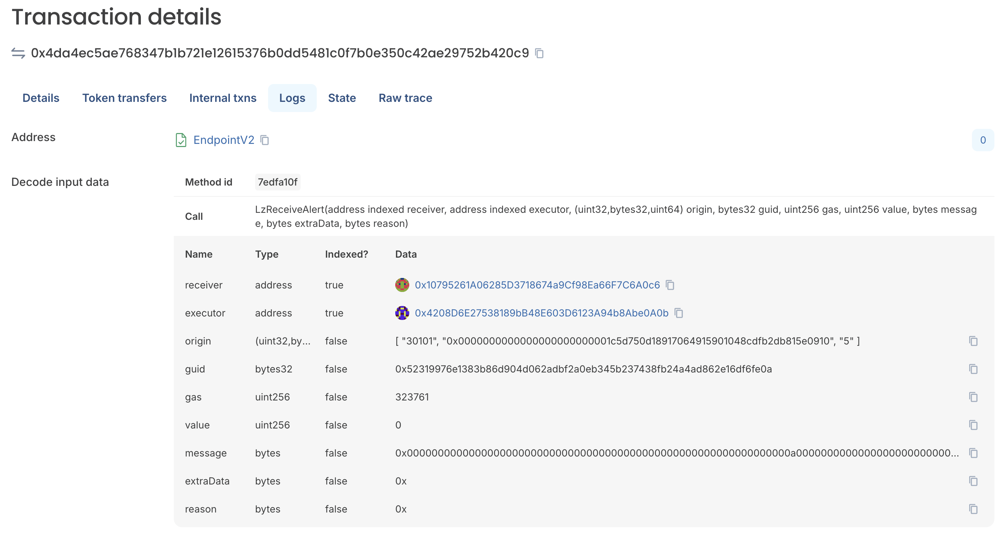
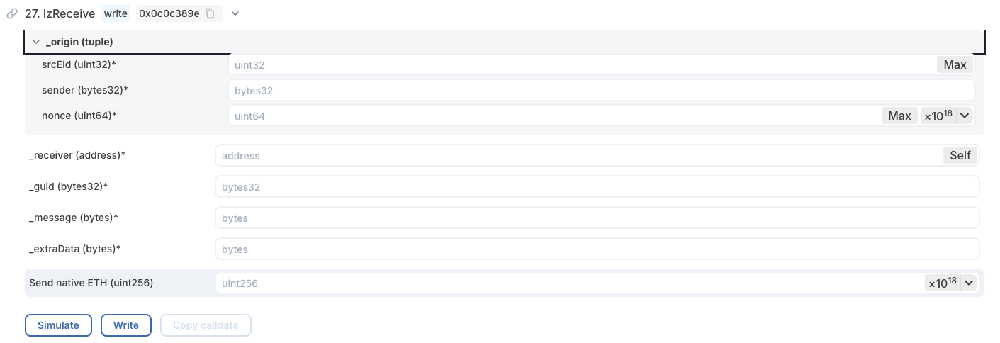
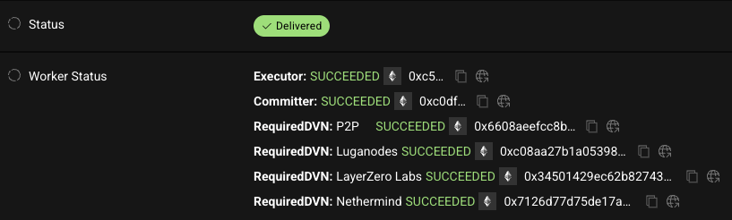

# Manual Execution: Cross-Chain Gateway Proposals

> This runbook only applies when a cross-chain proposal has already been approved and executed on Ethereum, but the LayerZero message delivery to Gateway failed.

**Related guides:**
- [Creating Gateway proposals](creating-proposals-gateway.md): how to create and submit cross-chain Gateway proposals
- [Reviewing proposals](reviewing-proposals.md): how to verify proposals before approving
- [CLI reference](cli-reference.md): detailed CLI tool documentation

---

## When to use this

After a cross-chain proposal is approved and executed on Ethereum, a LayerZero message is sent to the Gateway chain. Execution on Gateway can fail if the `options` value did not set a sufficient gas limit for the LayerZero Executor.

**Symptoms:**
- LayerZeroScan shows `Status: Verified` but stuck at execution.
- Error logged: `CouldNotPaseError(string) 0x` or `CouldNotPaseError(string) 0x0xa19118be000000000000...`

## Fix: Manually call `lzReceive`

1. Go to the Gateway [`EndpointV2` contract](https://explorer-zama-gateway-mainnet.t.conduit.xyz/address/0x6F475642a6e85809B1c36Fa62763669b1b48DD5B?tab=write_contract) on the Blockscout explorer.
   - Address: `0x6F475642a6e85809B1c36Fa62763669b1b48DD5B`

2. Get the required field values from the `LzReceiveAlert` event:
   - On LayerZeroScan, find the Executor transaction hash (the one with `SIMULATION REVERTED` status in `Worker Status`).
   - On the Gateway Blockscout explorer, look up that transaction → **Logs** tab → `LzReceiveAlert` event.

3. Fill in all `lzReceive` fields from the event data.

4. Using any account with ETH on Gateway, click **Write** to unstick the message.

## Post-execution verification

Check that Gateway contracts are in the expected state. For example, for unpausing:
- Call `paused()` on [`InputVerifier`](https://explorer-zama-gateway-mainnet.t.conduit.xyz/address/0xcB1bB072f38bdAF0F328CdEf1Fc6eDa1DF029287?tab=read_write_proxy): should return `false`.
- Call `paused()` on [`Decryption`](https://explorer-zama-gateway-mainnet.t.conduit.xyz/address/0x0f6024a97684f7d90ddb0fAAD79cB15F2C888D24?tab=read_write_proxy): should return `false`.

