# Reviewing Governance Proposals

Proposals are reviewed and voted on via the Aragon App UI:

- [Mainnet DAO](https://app.aragon.org/dao/ethereum-mainnet/zama.dao.eth/dashboard)
- [Testnet DAO](https://app.aragon.org/dao/ethereum-sepolia/0x08e8a84c3c8c7cba165B1adcf67Ae4639eF84f52/dashboard)
- [Devnet DAO](https://app.aragon.org/dao/ethereum-sepolia/0x41d84D9F00263eaF80f3526C157CD49c263CAd59/dashboard)

**Source of truth for addresses:** the [protocol-registry](https://github.com/zama-ai/protocol-registry) repo.

**Related guides:**
- [Creating Ethereum proposals](creating-proposals-ethereum.md): how to create and submit Ethereum proposals
- [Creating remote proposals](creating-proposals-remote.md): how to create and submit cross-chain proposals to EVM destinations
- [CLI reference](cli-reference.md): detailed CLI tool documentation

> **Both** the Aragon frontend review and the CLI inspector check should be performed for every proposal. The CLI check protects against a compromised Aragon frontend.

---

## Part 1: Review via the Aragon App UI

### Understanding proposals and actions

Each proposal includes:
- A **title, summary, and body**: treat it as a comment, not as a source of truth. Never trust addresses or values in these fields.
- One or more **actions**: contract function calls executed when the proposal is approved.

Each action consists of:
- A contract address
- A function identifier
- All function arguments

Example: a proposal calling `grantRole` on the `ZamaERC20` contract at `0xA12C...f4f3`:

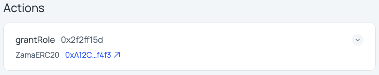

Expand an action to see all arguments:

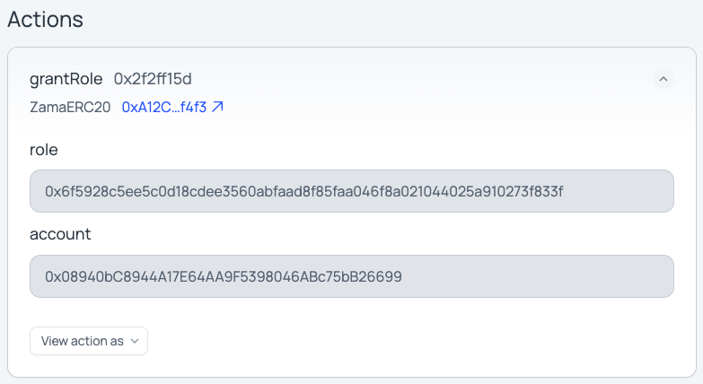

### Verifying actions

For each action, check:

1. **Contract name**: verify on the block explorer.
2. **Contract address**: verify against the protocol-registry repo. Confirm you're on the correct chain (mainnet/testnet/devnet).
3. **Source code**: For new contracts or new proxied implementations (see below), inspect on the block explorer.
4. **Contract relationships**: use diagrams in protocol-registry to verify ownership, roles, and other relationships.
5. **All arguments**: including magic constants (role hashes) and ABI-encoded values.

### Verifying proxied contracts

Some contracts use ERC1967 proxies:

1. On the block explorer, mark the contract as a proxy.
2. Find the latest implementation address.
3. Inspect the implementation's source code.

#### Blockscout 

Latest implementation can be found in the `Contract` tab next to the `Implementation` label.

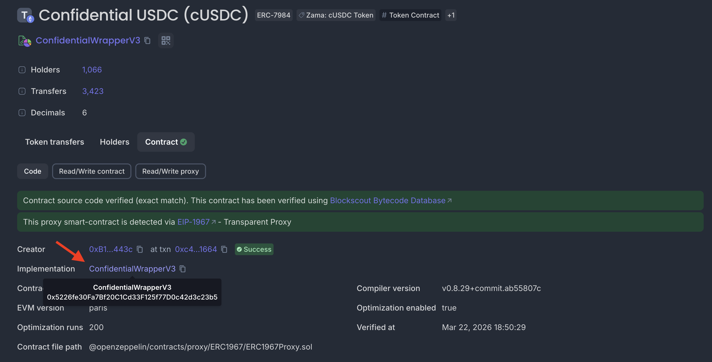


#### Etherscan

Latest implementation can be found in the `Contract` tab in the `Past Implementations` section, with status `Active`.

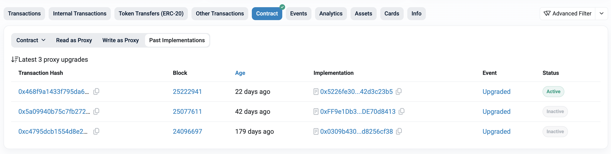

### Verifying magic constants

Some functions take hash values as inputs (e.g. role assignments):

- Recompute the hash: `keccak256("ROLE_NAME")`
- Compare against the value in the proposal.
- Use an online tool like [keccak256 calculator](https://emn178.github.io/online-tools/keccak_256.html) or Foundry's `cast`.

### Verifying cross-chain proposals

For proposals calling `sendRemoteProposal` on `GovernanceOAppSender`:

1. Copy the minimal template (`cp remote-proposal-temp.example.json remote-proposal-temp.json`) and fill `targets[i]`, `functionSignatures[i]`, and `datas[i]` with the values shown in the Aragon frontend.
2. Run the fill script for the matching destination:
   ```bash
   npm run fill-options-remote-proposal -- --destination gateway-mainnet   # or gateway-testnet, gateway-devnet, polygon-amoy-testnet, …
   ```
   Read the **sanity-check** output it prints — each `datas[i]` decoded against its `functionSignatures[i]` — and confirm every decoded call matches the Aragon frontend. (The script aborts on a `datas`/signature mismatch.)
3. Compare the generated `options` value in `remote-proposal-filled.json` with the Aragon frontend:
   - **Match**: gas estimation is correct. The proposal is likely valid.
   - **Mismatch**: decode and compare both values. Options can drift by a a few gas as it depends on several factors like the gas price oracle used by LayerZero. Both values must stay close:
     ```bash
     npm run decode-options-remote-proposal -- --options <OPTIONS_HEX>
     ```
     Output example:
     ```
     Options hex:   0x000301001101000000000000000000000000000493e0
     gasLimit:      300000
     nativeValue:   0
     ```
     - Both `nativeValue`s should be 0.
     - `gasLimit` values should differ by at most a few percentage points.
4. Optionally cross-check any `datas[i]` independently with `cast abi-decode 'f()(<types>)' <DATA>` (types must match `functionSignatures[i]`).
5. **Also** run the `aragon-proposal-inspector` CLI tool (see [Part 2](#part-2-verify-via-the-cli-inspector)).

---

## Part 2: Verify via the CLI Inspector

The `aragon-proposal-inspector` tool provides an independent, RPC-only verification of proposals. It bypasses all Aragon-hosted infrastructure.

### One-time setup

```bash
git clone https://github.com/zama-ai/protocol-apps.git
cd protocol-apps/scripts/governance-proposal-builder
npm install
cp .env.example .env
```

Edit `.env`:
- `RPC_ETHEREUM`: **required**. Sepolia or mainnet RPC URL. Use your own node if possible.
- `ETHERSCAN_API_KEY`: **optional but recommended**. Enables ABI fetching for verified contracts, making logs more human-readable.

> **Trust model:** The script only trusts the RPC endpoint and ethers.js. Even if Etherscan is compromised, the script ABI-decodes raw calldata locally — a wrong ABI would cause decoding to fail.

### Get the required inputs

You need two values:

**1. Plugin address (`0xPLUGIN`)**
- Source: [protocol-registry repo](https://github.com/zama-ai/protocol-registry)
- This is the Multisig Plugin address, **not** the DAO contract address. Ex: `GOV_MULTISIG`.
- Do not get this from the Aragon frontend — that defeats the purpose of independent verification.

**2. Proposal ID (`PROPOSAL_ID`)**

Two ways to find it:

- **Option A:** Copy the "Onchain ID" value from the Aragon proposal page.
- **Option B (recommended):** Click "Published: \<DATE\>" on the proposal page → opens Etherscan → go to **Logs** tab → find the `proposalId` (a large `uint256` value).

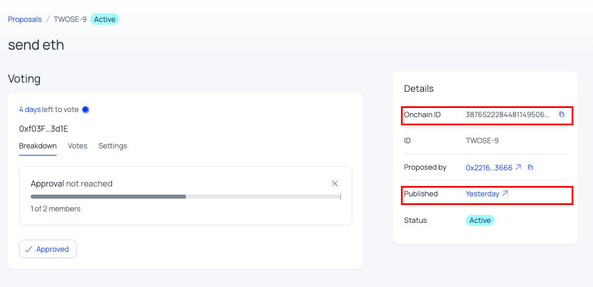

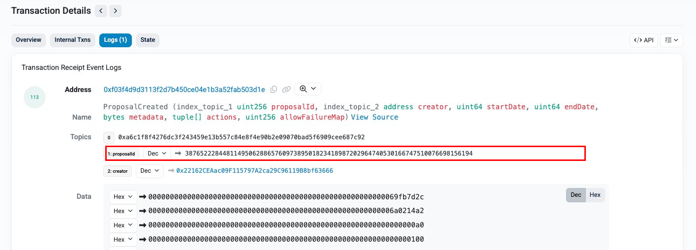

### Run the inspector

```bash
npm run aragon-proposal-inspector -- --plugin 0xPLUGIN --id PROPOSAL_ID
```

**Note:** For testnet or devnet, override the RPC URL directly:
```bash
npm run aragon-proposal-inspector -- --plugin 0xPLUGIN --id PROPOSAL_ID --rpc https://your.rpc
```

Example output:

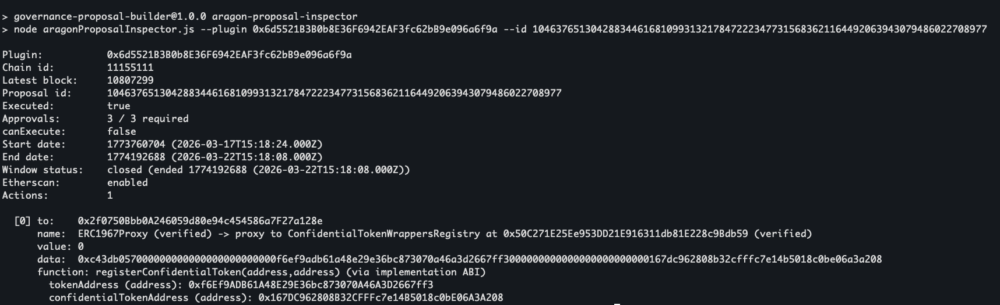

### What to check in the output

- **`to` addresses**: must match the expected contract addresses.
- **`function` names and arguments**: must match what the Aragon frontend shows.
- **Bytes inputs**: for encoded data (e.g. `upgradeToAndCall` with `reinitializeV2()`), verify with:
  ```bash
  cast calldata 'reinitializeV2()'
  ```

### Final check: verify `proposalId` in your wallet

> **⚠️ This step is critical for security.**

1. Only after completing both UI review and CLI verification, approve the proposal in the Aragon frontend.
2. In your wallet plugin (e.g. MetaMask), open **advanced details**.
3. Verify the `proposalId` matches the expected value.
4. **Verify the full `proposalId` on your hardware wallet screen.**

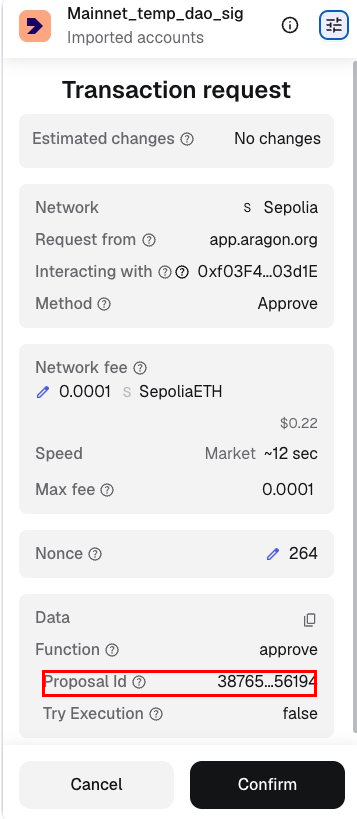


## Part 3 (cross-chain only): Track status

After execution on Ethereum, track the cross-chain message on [LayerZeroScan](https://layerzeroscan.com/):

```
https://layerzeroscan.com/tx/<TX_HASH_OF_PROPOSAL_EXECUTION_ON_ETHEREUM>
```

- Delivery to the destination takes ~15 Ethereum blocks (~3–4 minutes).

If delivery to the destination failed, see [Manual Execution: Remote](manual-execution-remote.md).

---

## Examples

### Example A: Role Grant on Ethereum

Proposal: grant the pausing role on the $ZAMA token to the `PauserSetWrapper` contract.


**Verify the contract address:**

1. Follow the link to the block explorer → confirm the full address.
2. Compare against the [protocol-registry repo](https://github.com/zama-ai/protocol-registry).

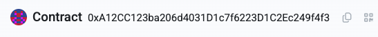

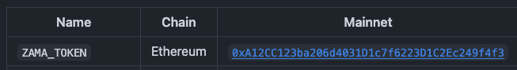

**Verify the source code:**

1. Inspect the contract source on the block explorer.

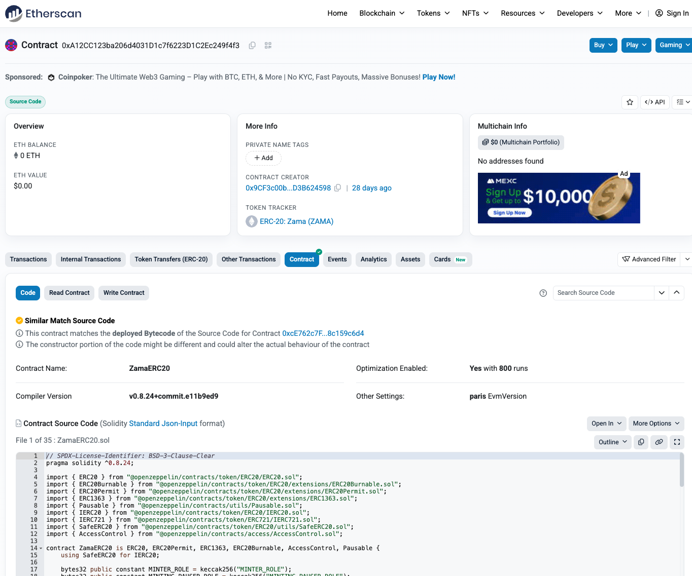

2. Check the `grantRole` function: it should grant `role` to `account`.

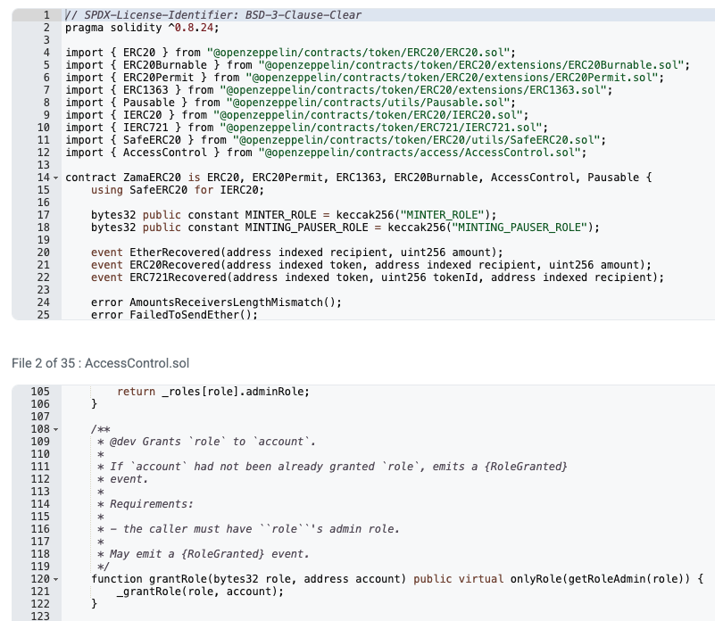

**Verify the role hash:**

1. Find `MINTING_PAUSER_ROLE` in the source code of `ZamaERC20`.
2. It's computed as `keccak256("MINTING_PAUSER_ROLE")`.
3. Recompute and confirm it matches the proposal value.

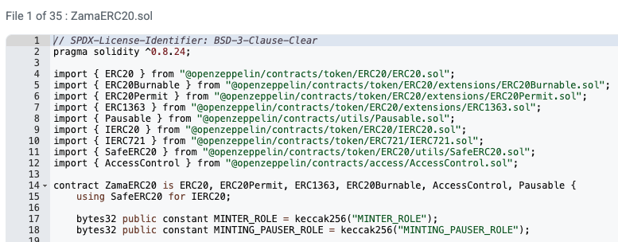

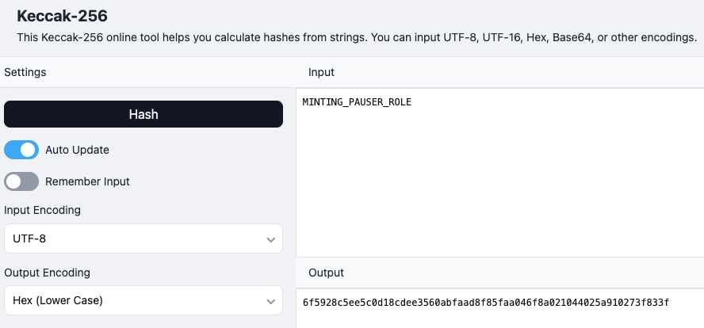

**Verify the account address:**

1. Look up `PAUSER_SET_WRAPPER` in [protocol-registry repo](https://github.com/zama-ai/protocol-registry) → matches `PAUSER_SET_WRAPPER` on mainnet.
2. Check the [documentation diagrams](https://docs.zama.org/protocol/protocol-apps/governance/pausing#structure) to confirm it should have the pausing role.

### Example B: Cross-Chain Gateway Proposal

Proposal: call `sendRemoteProposal` on `GovernanceOAppSender` at `0x9096...4932`.

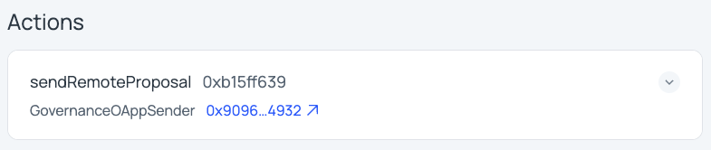

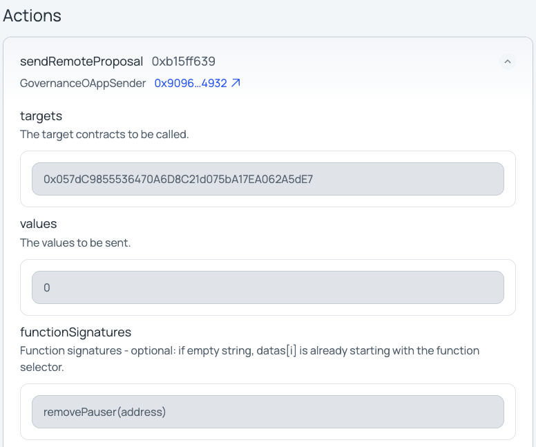

To verify:
1. Follow the [cross-chain verification steps](#verifying-cross-chain-proposals) using the CLI builder.
2. **Also** run the `aragon-proposal-inspector` CLI tool (see [Part 2](#part-2-verify-via-the-cli-inspector)).
