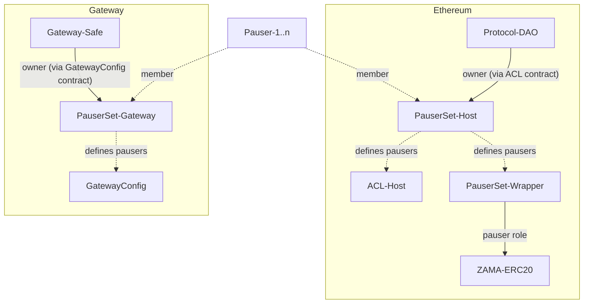

# Pausing

Circuit breakers are deployed on all chains involved with the Zama protocol. Any operator can trigger any of these on their own to pause parts of the protocol, but a governance vote is needed to unpause again.

## Contract addresses

All deployed pauser contract addresses can be found in the [addresses directory](addresses/README.md).

## Wallets

Each operator has their own wallet that can be used to trigger the circuit breakers. This address presents a trade-off between being readily available, for instance to anyone who’s on-call, while also being able to potentially cause significant damage if misused.

Operators are free to choose their implementation, but we suggest to use a hot wallet kept as a secret in their deployment system.

## Targets

The following components can be paused.

| Component   | Functionality |
| ----------- | ------------- |
| $ZAMA token | Minting can be paused |
| Ethereum    | ACL updates can be paused |
| Gateway     | Decryption requests can be paused |
| Gateway     | Input verification requests can be paused |

