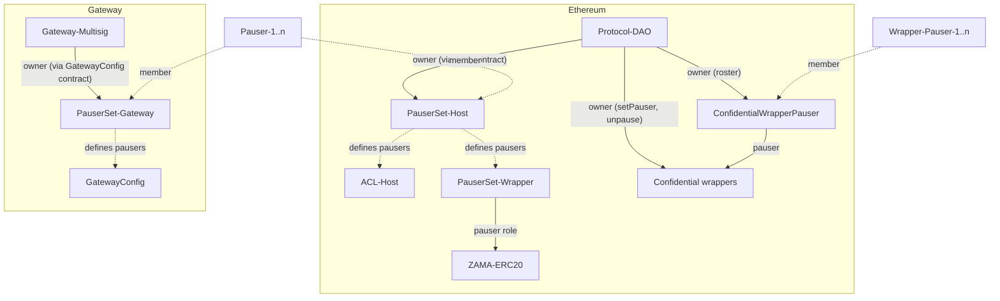

# Pausing

Circuit breakers are deployed on all chains involved with the Zama protocol. A single member of the relevant pauser set can trigger them on their own to pause parts of the protocol, but a governance vote is needed to unpause again.

Two pauser sets exist:

- **Protocol circuit breakers** (fhevm `PauserSet` contracts): any operator can pause the ACL, the Gateway and $ZAMA minting.
- **Confidential wrapper pauser** (`ConfidentialWrapperPauser`, one per chain): a roster chosen by that chain's governance can pause any confidential wrapper. Operators are not part of this roster.

## Contract information

| Resource               | Link                                                                                                                                 |
| ---------------------- | ------------------------------------------------------------------------------------------------------------------------------------ |
| Deployed addresses     | [Addresses directory](addresses/README.md)                                                                                           |
| Source code            | [PauserSetWrapper.sol](https://github.com/zama-ai/protocol-apps/blob/main/contracts/pauserSetWrapper/contracts/PauserSetWrapper.sol) |
| Source code (wrappers) | [ConfidentialWrapperPauser.sol](../contracts/confidential-wrapper-pauser/contracts/ConfidentialWrapperPauser.sol)                    |
| Runbook (wrappers)     | [Deploy the confidential wrapper pauser](deployment/deploy-wrapper-pauser-runbook.md)                                                |

## Structure

```mermaid
flowchart
    subgraph Ethereum
        Protocol-DAO
        PauserSet-Host
        ACL-Host
        PauserSet-Wrapper
        ZAMA-ERC20
        Wrapper-Pauser[ConfidentialWrapperPauser]
        cWrappers[Confidential wrappers]
    end

    subgraph Gateway
        Gateway-Multisig
        PauserSet-Gateway
        GatewayConfig
    end

    Protocol-DAO -- owner (via ACL contract) --> PauserSet-Host
    Pauser-1..n -. member .-> PauserSet-Host

    PauserSet-Host -. defines pausers .-> ACL-Host
    PauserSet-Host -. defines pausers .-> PauserSet-Wrapper
    PauserSet-Wrapper -- pauser role --> ZAMA-ERC20

    Protocol-DAO -- owner (roster) --> Wrapper-Pauser
    Protocol-DAO -- owner (setPauser, unpause) --> cWrappers
    Wrapper-Pauser-1..n -. member .-> Wrapper-Pauser
    Wrapper-Pauser -- pauser --> cWrappers

    Gateway-Multisig -- owner (via GatewayConfig contract) --> PauserSet-Gateway
    Pauser-1..n -. member .-> PauserSet-Gateway
    PauserSet-Gateway -. defines pausers .-> GatewayConfig
```

## Wallets

Each operator has their own wallet that can be used to trigger the protocol circuit breakers. The confidential wrapper roster is separate: on mainnet it is made of Zama-controlled signer accounts, on testnet of the testnet DAO members, and governance changes it with `addPauser` / `removePauser` on the chain's `ConfidentialWrapperPauser`. This address presents a trade-off between being readily available, for instance to anyone who’s on-call, while also being able to potentially cause significant damage if misused.

Operators are free to choose their implementation, but we suggest to use a hot wallet kept as a secret in their deployment system.

## Targets

The following components can be paused.

| Component             | Functionality                                                                                                                                                                            |
| --------------------- | ---------------------------------------------------------------------------------------------------------------------------------------------------------------------------------------- |
| $ZAMA token           | Minting can be paused                                                                                                                                                                    |
| Ethereum              | ACL updates can be paused                                                                                                                                                                |
| Gateway               | Decryption requests can be paused                                                                                                                                                        |
| Gateway               | Input verification requests can be paused                                                                                                                                                |
| Confidential wrappers | Wrap, unwrap, unwrap finalization and confidential transfers can be paused, per wrapper, by the chain's `ConfidentialWrapperPauser` roster; only the wrapper owner (governance) unpauses |

## Confidential wrappers

Every confidential wrapper exposes `pause()` to a single address, its `pauser()`, and `unpause()` to its owner. On each chain, governance points every wrapper's `pauser()` at one `ConfidentialWrapperPauser` through `setPauser`. That contract holds the roster (readable with `pausers()`, changed by its owner with `addPauser` / `removePauser`) and forwards `pause()` to one wrapper (`pause(address)`) or to many at once (`pause(address[])`, best effort: a wrapper that rejects the call is reported with `WrapperPauseFailed` and the rest still stops; a wrapper that is already paused is reported with `WrapperAlreadyPaused`). It calls every entry as a wrapper, so a batch must be built from the chain's `ConfidentialTokenWrappersRegistry`, never from a token list. Its owner is the chain's governance (OpenZeppelin `Ownable2Step`, renouncing disabled), so adding or removing a roster member is a governance action, as is unpausing. A wrapper whose `pauser()` is the zero address cannot be paused by anyone.

Deployment, arming and rehearsal are described in the [pauser runbook](deployment/deploy-wrapper-pauser-runbook.md).
