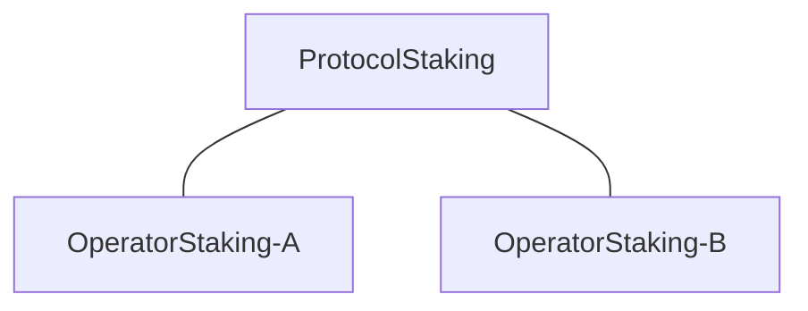
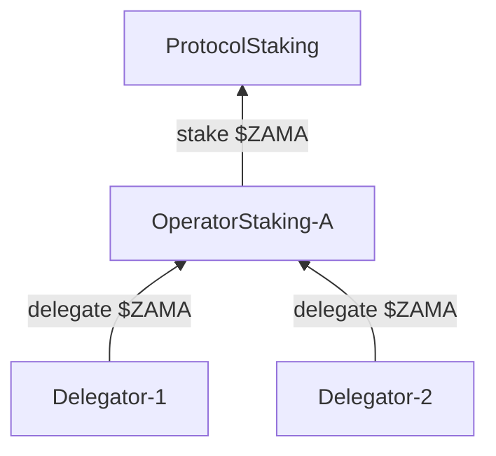
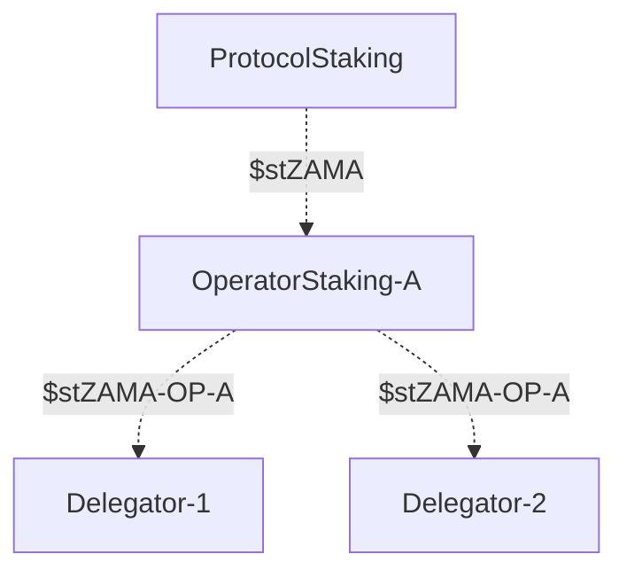
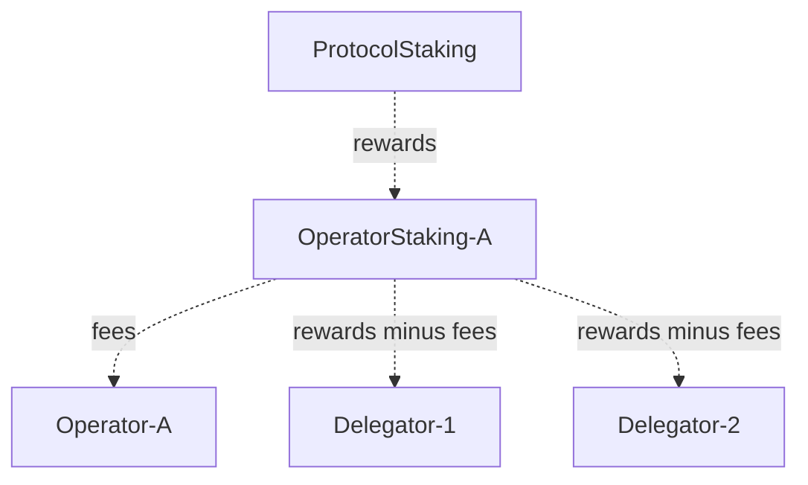
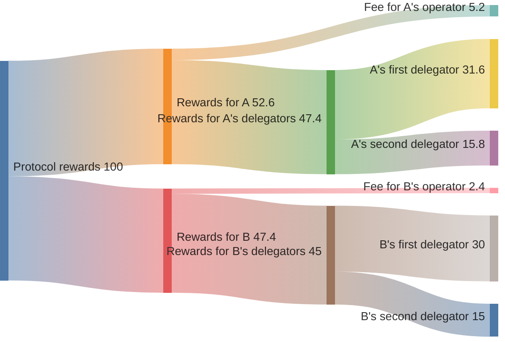

# Staking

Staking in the Zama protocol happens in a two level hierarchy:

* operators stake on the protocol, and
* token holders delegate stake to operators.

Anyone can stake on the protocol, but only the elected operators receive commission fees, and only the delegators on elected operators receive staking rewards. Elected operators are chosen multiple times per year via governance and have a responsibility to participate in the daily execution of the protocol.


All staking happens on Ethereum. Only non-confidential $ZAMA is supported for now.


All contracts are owned and maintained by [protocol governance](governance.md).

## Structure

The hierarchy is implemented by a protocol staking contract and an operator staking contract. The protocol staking contract is at the root, and one operator staking contract is deployed per operator.

Each operator staking contract is also deployed together with its own operator rewarder contract that is responsible for paying out commission fees and staking rewards. Its address can be retrieved via the `rewarder()` function on the operator staking contract.

The whole hierarchy is deployed per role, meaning there is one protocol staking contract for the coprocessor and one for the KMS. If an operator is operating as both a coprocessor node and a KMS node, then that operator has two operator staking contracts that independently stake on the corresponding protocol staking contract.

## Staking and delegating

The operator staking contracts are used by token holder to delegate stake on the protocol. This includes the operators themselves, who stake on the protocol by delegating via their operator staking contract like any other token holder. Token holders may delegate to multiple operator staking contracts at the same time. Both staking and delegation is done in $ZAMA.

Delegation is done by first approving an amount of $ZAMA to an operator staking contract and then calling a function on it. This function transfers $ZAMA from the message sender to the operator staking contract, and then from the operator staking contract to the protocol staking contract.

In return, the operator staking contract obtains protocol staking shares, and the delegator obtains operator staking shares. In the diagram below these are $stZAMA and $stZAMA-OP-A, respectively.

The operator staking shares are liquid and unique for each operator staking contract, while the protocol staking shares are not liquid. Both types of shares are unique for each role, i.e. shares from the KMS hierarchy are different than shares from the coprocessor hierarchy.

## Fees and rewards

The protocol staking contracts are continuously distributing staking rewards to the operator staking contracts, who take a cut for the operators as a commission fee, and distribute the rest to their delegators. All fees and rewards are paid in $ZAMA.

The fees and rewards are generated virtually and are not minted until manually claimed by an operator or delegator by interacting with the operator rewarder contract. When a delegator makes a claim for their staking rewards, their earnings since their last claim are calculated, minted, and transferred. Likewise when an operator makes a claim for their commission fee. This means that rewards are _not_ automatically claimed nor re-delegated. Delegators may claim rewards immediately after delegating.

The commission fee percentage is independently set for each operator staking contract by the operator, who may adjust it at any time by calling `setFee()` on the operator rewarder contract. However, it is capped at 20%, which itself can only be changed by governance. The distribution done by the protocol staking contract is based on the square root of the amount staked by each operator staking contract. The distribution done by the operator staking contract, after taking the commission fee, is pro rata based on the amount delegated by each delegator. Note that the protocol staking contract is using a concave function to incentivize decentralization, since delegating to small pools hence generate more staking rewards than delegating to large pools.

Below is an example to illustrate. We assume that for a given role there are two operator staking contracts, denoted _A_ and _B_, having staked 100 and 91 tokens, respectively. The graph below then shows how 100 rewards are distributed, assuming the operators has set a commission fee of 10% and 5%, respectively, and that they each have two delegators where the first has delegated double the amount of the second.

In summary, this means that the APR/APY for delegating to an operator depends on the following parameters:

- Per role yearly protocol fees and rewards rate
- Square root of combined amount delegated through the operator
- Operator fee percentage
- Amount delegated to the operator

### Calculating the rewards rate

The rewards rate is defined as tokens-per-second and is determined as follows:

1. The total yearly rewards amount to be paid out is determined once a year as a percentage of the current total supply of $ZAMA. This is currently set to 5% but may be changed through a governance proposal.
2. This total amount is divided between the roles, with 40% going to coprocessor operators and 60% to KMS operators.
3. Each per role amount is converted into a per role tokens-per-second reward rate for the year.

### Eligible

It is important to note that only _eligible_ operator staking contracts generate rewards. For now, becoming eligible is a manual process ending with a protocol governance proposal. As part of the process, operators are asked to run certain off-chain services to participate in the execution of the protocol. Checking whether an operator is currently eligible can be done onchain.

Any operator who’s operator staking contract has staked sufficiently on the protocol, can ask to be considered eligible at the next operator election. 13 KMS node operators and 5 coprocessor operators are chosen at each election, based on staking amount and stability reputation.

## Redeeming

Redeeming from operator staking contracts is a two-step process subject to a cooldown period (determined by the protocol staking contract). The period is currently set to 7 days and is updatable via protocol governance. Note that operator staking contract shares are transferable (as ordinary ERC20), and hence offer an alternative “withdrawal" process without being subject to the cooldown period. Shares from the protocol staking contracts are *not* transferable.
