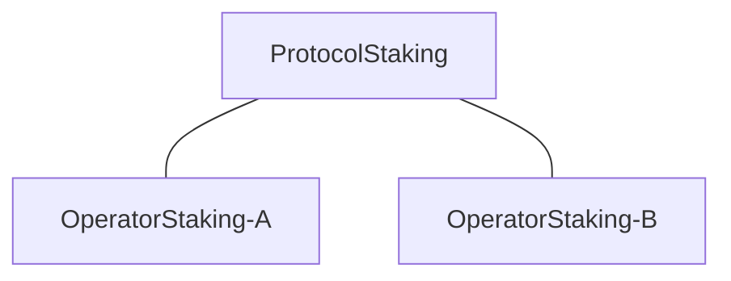
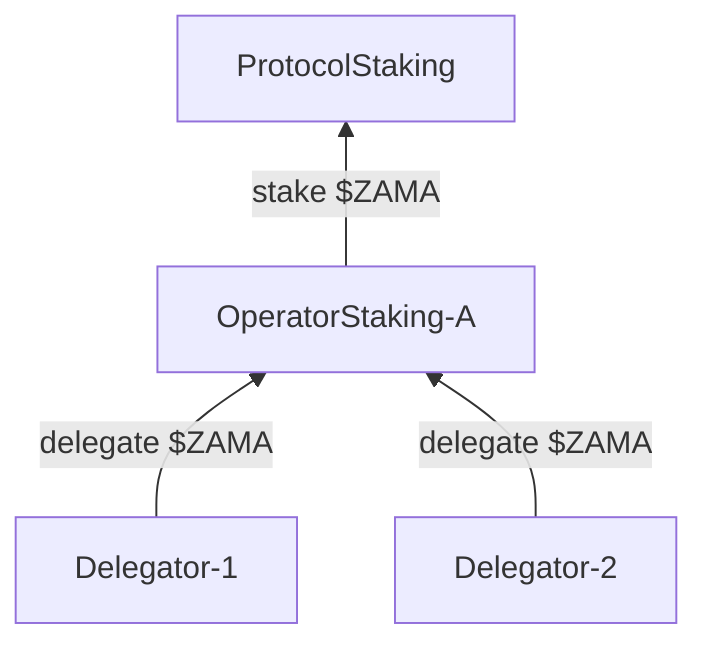
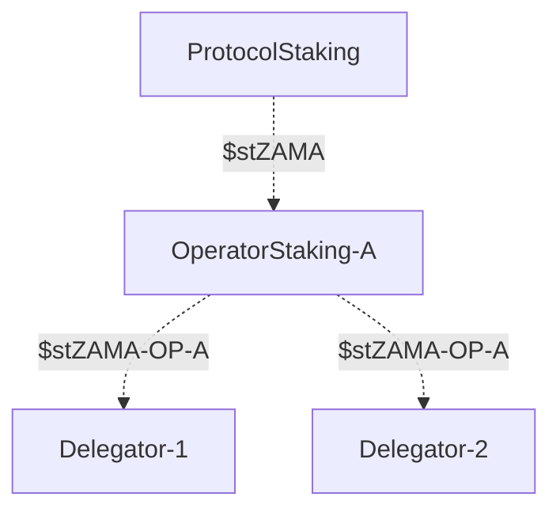
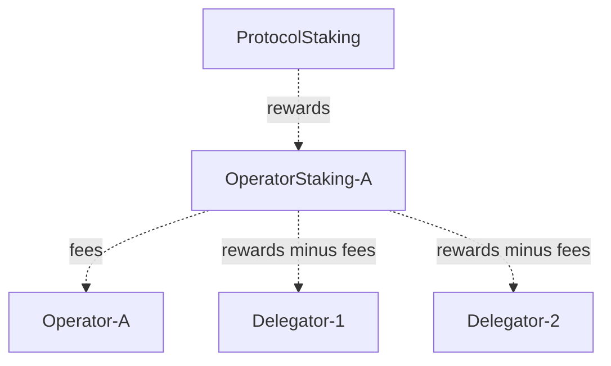
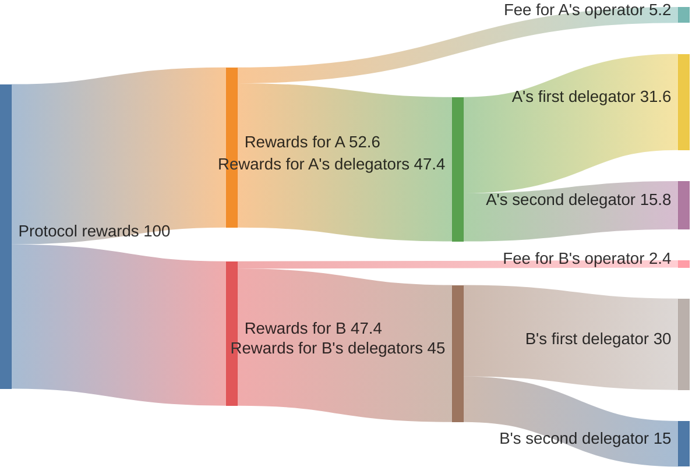

# Staking

Staking in the Zama protocol happens in a two level hierarchy:

* operators stake on the protocol, and
* token holders delegate stake to operators.

Anyone can stake on the protocol, but only the elected operators receive commission fees, and only the delegators on elected operators receive staking rewards. Elected operators are chosen multiple times per year via governance and have a responsibility to participate in the daily execution of the protocol.


All staking happens on Ethereum. Only non-confidential $ZAMA is supported for now.


All contracts are owned and maintained by [protocol governance](governance.md).

## Contract addresses

All deployed staking contract addresses (protocol and operator) can be found in the [addresses directory](addresses/README.md).

## Structure

The hierarchy is implemented by a protocol staking contract and an operator staking contract. The protocol staking contract is at the root, and one operator staking contract is deployed per operator.


```mermaid
flowchart TB
    ProtocolStaking --- OperatorStaking-A
    ProtocolStaking --- OperatorStaking-B
```

Each operator staking contract is also deployed together with its own operator rewarder contract that is responsible for paying out commission fees and staking rewards. Its address can be retrieved via the `rewarder()` function on the operator staking contract.

The whole hierarchy is deployed per role, meaning there is one protocol staking contract for the coprocessor and one for the KMS. If an operator is operating as both a coprocessor node and a KMS node, then that operator has two operator staking contracts that independently stake on the corresponding protocol staking contract.

## Staking and delegating

The operator staking contracts are used by token holder to delegate stake on the protocol. This includes the operators themselves, who stake on the protocol by delegating via their operator staking contract like any other token holder. Token holders may delegate to multiple operator staking contracts at the same time. Both staking and delegation is done in $ZAMA.

Delegation is done by first approving an amount of $ZAMA to an operator staking contract and then calling a function on it. This function transfers $ZAMA from the message sender to the operator staking contract, and then from the operator staking contract to the protocol staking contract.


```mermaid


flowchart BT
    OperatorStaking-A -- stake $ZAMA --> ProtocolStaking
    Delegator-1 -- delegate $ZAMA --> OperatorStaking-A
    Delegator-2 -- delegate $ZAMA --> OperatorStaking-A
```

In return, the operator staking contract obtains protocol staking shares, and the delegator obtains operator staking shares. In the diagram below these are $stZAMA and $stZAMA-OP-A, respectively.


```mermaid
flowchart TB
    ProtocolStaking -. $stZAMA .-> OperatorStaking-A
    OperatorStaking-A -. $stZAMA-OP-A .-> Delegator-1
    OperatorStaking-A -. $stZAMA-OP-A .-> Delegator-2
```

The operator staking shares are liquid and unique for each operator staking contract, while the protocol staking shares are not liquid. Both types of shares are unique for each role, i.e. shares from the KMS hierarchy are different than shares from the coprocessor hierarchy.


For more information on the underlying mechanics of shares and their decimals, please see the [Virtual shares](#virtual-shares) section.


## Fees and rewards

To clarify the terminology used:
- **Operator Rewards**: The total staking yields accumulated from the protocol by an operator's pool. These are distributed to the delegators based on their proportional stake.
- **Operator Fees**: The percentage commission taken from the Operator Rewards. This is paid out directly to the operator.

The protocol staking contracts are continuously distributing staking rewards to the operator staking contracts, who take a cut for the operators as a commission fee, and distribute the rest to their delegators. All fees and rewards are paid in $ZAMA.


```mermaid


flowchart TB
    ProtocolStaking -. rewards .-> OperatorStaking-A
    OperatorStaking-A -. fees .-> Operator-A
    OperatorStaking-A -. rewards minus fees .-> Delegator-1
    OperatorStaking-A -. rewards minus fees .-> Delegator-2
```

The fees and rewards are generated virtually and are not minted until manually claimed by an operator or delegator by interacting with the operator rewarder contract. When a delegator makes a claim for their staking rewards, their earnings since their last claim are calculated, minted, and transferred. Likewise when an operator makes a claim for their commission fee. This means that rewards are _not_ automatically claimed nor re-delegated. Delegators may claim rewards immediately after delegating.

The commission fee percentage is independently set for each operator staking contract by the operator, who may adjust it at any time by calling `setFee()` on the operator rewarder contract. However, it is capped at 20%, which itself can only be changed by governance. The distribution done by the protocol staking contract is based on the square root of the amount staked by each operator staking contract. The distribution done by the operator staking contract, after taking the commission fee, is pro rata based on the amount delegated by each delegator. Note that the protocol staking contract is using a concave function to incentivize decentralization, since delegating to small pools hence generate more staking rewards than delegating to large pools.

Below is an example to illustrate. We assume that for a given role there are two operator staking contracts, denoted _A_ and _B_, having staked 100 and 91 tokens, respectively. The graph below then shows how 100 rewards are distributed, assuming the operators has set a commission fee of 10% and 5%, respectively, and that they each have two delegators where the first has delegated double the amount of the second.


```mermaid


sankey
    Protocol rewards, Rewards for A, 52.6
    Protocol rewards, Rewards for B, 47.4

    Rewards for A, Fee for A's operator, 5.2
    Rewards for A, Rewards for A's delegators, 47.4
    Rewards for A's delegators, A's first delegator, 31.6
    Rewards for A's delegators, A's second delegator, 15.8

    Rewards for B, Fee for B's operator, 2.4
    Rewards for B, Rewards for B's delegators, 45.0
    Rewards for B's delegators, B's first delegator, 30.0
    Rewards for B's delegators, B's second delegator, 15.0
```

In summary, this means that the APR/APY for delegating to an operator depends on the following parameters:

- Per role yearly protocol fees and rewards rate
- Square root of combined amount delegated through the operator
- Operator fee percentage
- Amount delegated to the operator

### Calculating the rewards rate

The rewards rate is defined as tokens-per-second and is determined as follows:

1. The total yearly rewards amount to be paid out is determined once a year as a percentage of the current total supply of $ZAMA. This is currently set to 5% but may be changed through a governance proposal.
2. This total amount is divided between the roles, with 40% going to coprocessor operators and 60% to KMS operators.
3. Each per role amount is converted into a per role tokens-per-second reward rate for the year.

To calculate the rewards rate for each role, we can use the following formula:

```python
SECONDS_PER_YEAR = 365 * 24 * 60 * 60
TOTAL_YEARLY_INFLATION_PROPORTION = 0.05
TOTAL_SUPPLY = 11_000_000_000 * 10**18

def get_reward_rate() -> tuple[int, int]:
    """
    Compute the reward rates for KMS and Coprocessors based on total supply.
    
    :return: A tuple (rate_kms, rate_coprocessors) in tokens per second
    """
    # Calculate the total yearly fees and rewards
    total_fees_rewards = int(TOTAL_SUPPLY * TOTAL_YEARLY_INFLATION_PROPORTION)
    
    # Divide into KMS (60%) and Coprocessors (40%)
    total_fees_rewards_kms = int(total_fees_rewards * 0.60)
    total_fees_rewards_coprocessors = int(total_fees_rewards * 0.40)
    
    # Calculate the per-second rates
    rate_kms = total_fees_rewards_kms // SECONDS_PER_YEAR
    rate_coprocessors = total_fees_rewards_coprocessors // SECONDS_PER_YEAR
    
    return rate_kms, rate_coprocessors
```

### Calculating the APR

The native APR for delegating to an operator depends on several factors:

1. [**Reward Rate:**](#calculating-the-rewards-rate) The rate of tokens per second, retrieved from `ProtocolStaking.rewardRate()`.
2. **Tokens per Pool:** The number of deposited tokens in each eligible `OperatorStaking` pool, retrieved from `ProtocolStaking.balanceOf(address(OperatorStaking))`.
3. **Fees per Pool:** The commission fee for each corresponding `OperatorRewarder` in basis points (where 10000 is 100%), retrieved from `OperatorRewarder.feeBasisPoints()`.

To calculate the APR for each operator pool, we can use the following formula:

```python
import math

SECONDS_PER_YEAR = 365 * 24 * 60 * 60

def compute_native_apr(
    reward_rate: int, 
    num_tokens_per_pool: list[int], 
    fees_per_pool: list[int]
) -> list[float]:
    """
    Compute the native APR for each eligible OperatorStaking pool.
    
    :return: List of percentage APRs for each pool
    """
    assert len(num_tokens_per_pool) == len(fees_per_pool), "Pool/Fee length mismatch"
    assert all(0 <= fee <= 10000 for fee in fees_per_pool), "Fees must be within 0 and 10000"
    assert all(0 <= tokens for tokens in num_tokens_per_pool), "Token amounts must be non-negative"
    assert reward_rate >= 0, "Reward rate must be non-negative"

    weights = [int(math.sqrt(tokens)) for tokens in num_tokens_per_pool]
    total_weight = sum(weights)
    
    fee_factors = [1 - (fee / 10000) for fee in fees_per_pool]
    rate_per_sec_per_pool = [reward_rate * (weight / total_weight) for weight in weights]
    
    pool_aprs = []
    for i in range(len(fee_factors)):
        net_reward_per_sec = rate_per_sec_per_pool[i] * fee_factors[i]
        pool_apr = (net_reward_per_sec / num_tokens_per_pool[i]) * SECONDS_PER_YEAR * 100
        pool_aprs.append(pool_apr)
    
    return pool_aprs
```

### Claiming Rewards

Rewards are not claimable from the the `OperatorStaking` or `ProtocolStaking` contracts directly. Instead, you should look at the associated `OperatorRewarder` contract (accessible through the `rewarder()` view function of an `OperatorStaking` contract).

Delegators can claim their rewards at any time by calling the `claimRewards(address receiver)` function on the `OperatorRewarder` contract, where `receiver` is the address that will receive the rewards. By default, only the caller is authorized to claim rewards on behalf of themselves, but a delegator can set another address as an allowed caller through the `setClaimer(address claimer_)` function. 

Rewards are calculated based on the amount of $ZAMA delegated to the operator and the reward rate. The rewards are paid out in $ZAMA and are subject to a commission fee to the operator. The fee is set by the operator and can be changed at any time.

### Claiming manually

Rewards can be claimed manually using the Zama staking dashboard. 

1. Navigate to the [Staking Dashboard](https://staking.zama.org/) and connect your wallet.
2. Navigate to the pool you have delegated to.
3. Click on **Stake/Manage** for the pool and then on **Claim Rewards** and confirm the transaction in your wallet.

### Claiming programmatically

Alternatively, rewards can be claimed programmatically by interacting with the smart contracts directly. This example assumes you are using `ethers.js` or a similar library, but the concepts apply universally.

First, you need the deployed contract addresses. These can be found in the [Contract addresses](#contract-addresses) section. You will need the address of the `OperatorStaking` contract that you delegated tokens to.

With the `OperatorStaking` address, you can fetch the associated `OperatorRewarder` contract, which handles the distribution of rewards.

```javascript
// ABI containing the rewarder() function
const operatorStakingAbi = ["function rewarder() view returns (address)"];
const operatorStaking = new ethers.Contract(operatorStakingAddress, operatorStakingAbi, provider);

// Fetch the rewarder address
const rewarderAddress = await operatorStaking.rewarder();
```

Once you have the `OperatorRewarder` address, you can call `claimRewards(address)` to claim the pending rewards.

```javascript
// ABI containing the claimRewards() function
const rewarderAbi = ["function claimRewards(address receiver)"];
const operatorRewarder = new ethers.Contract(rewarderAddress, rewarderAbi, signer);

// Claim rewards, sending them to the connected wallet
const tx = await operatorRewarder.claimRewards(await signer.getAddress());
await tx.wait();
```

### OperatorRewarder beneficiary

The beneficiary of an `OperatorRewarder` contract is the address that can set and claim fees. The beneficiary is set on the deployment of the `OperatorRewarder` contract and can be changed by the contract owner through the `transferBeneficiary(address newBeneficiary)` function.

To find the beneficiary of an `OperatorRewarder` contract, you can use the `beneficiary()` view function.

An `OperatorRewarder` beneficiary has the authority to change the fee percentage for the associated contract through the `setFee(uint16 basisPoints)` function. The fee percentage is set in basis points, where 10000 is 100%. Note that fees are subject to a maximum of 20% (2000 basis points) set by protocol governance.

The beneficiary also has the right to claim the accumulated fees from the `OperatorRewarder` contract through the `claimFee()` function. This will transfer any unpaid fees to the beneficiary address.

### Claiming fees

Continuing from the above [examples](#claiming-programmatically), operators can claim their accumulated fees from the `OperatorRewarder` contract.

Claimed fees are sent to the beneficiary of the `OperatorRewarder` contract.

```javascript
// ABI containing the claimFee() function
const rewarderAbi = ["function claimFee()"];
const operatorRewarder = new ethers.Contract(rewarderAddress, rewarderAbi, beneficiarySigner);

// Claim accumulated commission fees
const tx = await operatorRewarder.claimFee();
await tx.wait();
```

### Eligible

It is important to note that only _eligible_ operator staking contracts generate rewards. For now, becoming eligible is a manual process ending with a protocol governance proposal. As part of the process, operators are asked to run certain off-chain services to participate in the execution of the protocol. Checking whether an operator is currently eligible can be done onchain.

Any operator who’s operator staking contract has staked sufficiently on the protocol, can ask to be considered eligible at the next operator election. 13 KMS node operators and 5 coprocessor operators are chosen at each election, based on staking amount and stability reputation.

### Virtual shares

The operator staking contracts are built on top of the ERC4626 standard for tokenized vaults. To mitigate the well-known ERC4626 inflation attack, the `OperatorStaking` contract implements a decimal offset of 2. This means that 1 unit of the underlying asset is represented as 100 units of shares. 

Because the underlying staked asset ($ZAMA) has 18 decimals, the resulting operator staking shares (e.g., $stZAMA-OP-A) will always possess 20 decimals. When interacting with the contracts or calculating balances, it is important to remember this distinction. 

For example, when looking at the total stake of a pool or calculating historical rewards across different contracts:
* Calling `totalSupply()` on an `OperatorStaking` contract returns the total pool shares in the form of virtual shares. If the value returned is **100 * 10^20**, this equates to 100 $stZAMA-OP-A shares because the shares use 20 decimals.
* Alternatively, calling `historicalReward()` on an `OperatorRewarder` contract returns the total historical rewards accumulated by all delegators in the pool (ignoring commission fees). If the value returned is **10 * 10^18**, this equates to 10 $ZAMA because the rewarder contract operates directly in $ZAMA and uses the standard 18 decimals.

## Redeeming

Redeeming from operator staking contracts is a two-step process subject to a cooldown period (determined by the protocol staking contract). The period is currently set to 7 days and is updatable via protocol governance. Note that operator staking contract shares are transferable (as ordinary ERC20), and hence offer an alternative “withdrawal" process without being subject to the cooldown period. Shares from the protocol staking contracts are *not* transferable.

## Operator functions

Operators have access to specific functions across the staking contracts to manage their pools and commissions.

### OperatorRewarder

#### Core functions

* **`setFee(uint16 basisPoints)`**: Adjusts the commission percentage taken from the pool's generated rewards. The fee is expressed in basis points (e.g., `1000` = 10%). This value is capped by a maximum fee set by protocol governance (currently 20%). Calling this function automatically claims any unpaid fees at the old rate before applying the new rate. This must be called by the `OperatorRewarder` beneficiary.

* **`claimFee()`**: Claims all accumulated commission fees from the rewarder contract and transfers $ZAMA to the `OperatorRewarder` beneficiary address. This must be called by the `OperatorRewarder` beneficiary.

* **`feeBasisPoints()`** (view): Returns the current commission fee percentage in basis points.

* **`maxFeeBasisPoints()`** (view): Returns the maximum allowable fee in basis points that the beneficiary can set.

* **`unpaidFee()`** (view): Returns the amount of accumulated, uncollected commission fees in standard $ZAMA (18 decimals).

#### Advanced functions

* **`transferBeneficiary(address newBeneficiary)`**: Transfers the right to manage and claim the operator's commission fees to a new address. This function can only be called by the protocol's owner, meaning it must go through a DAO proposal. The `OperatorRewarder` intentionally does *not* claim unpaid fees during this transfer, making it a reliable way to recover stuck fees in the case of loss of access to the initial beneficiary account.

#### Delegator functions

* **`claimRewards(address receiver)`**: If identifying as a delegator and staking $ZAMA into your own pool, your accumulated rewards are manually claimed via `claimRewards(address receiver)`.

* **`setClaimer(address claimer_)`**: Authorizes another account to claim the pool rewards from `claimRewards()` on your behalf.

### OperatorStaking

* **`stakeExcess()`**: Restakes any excess liquid $ZAMA held by the `OperatorStaking` contract back into the `ProtocolStaking` contract. Excess tokens can accumulate from direct $ZAMA donations or transfers to the contract, or from unredeemed slashed positions. While *anyone* can invoke this function, operators may want to call it to maximize their pool's total staking weight and the resulting rewards.
