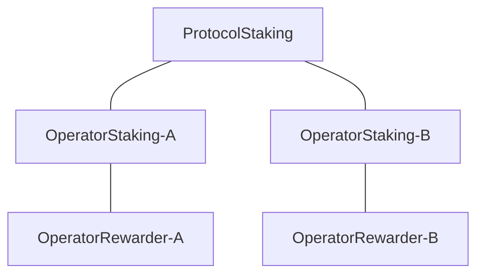
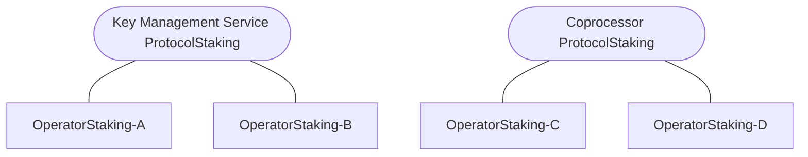
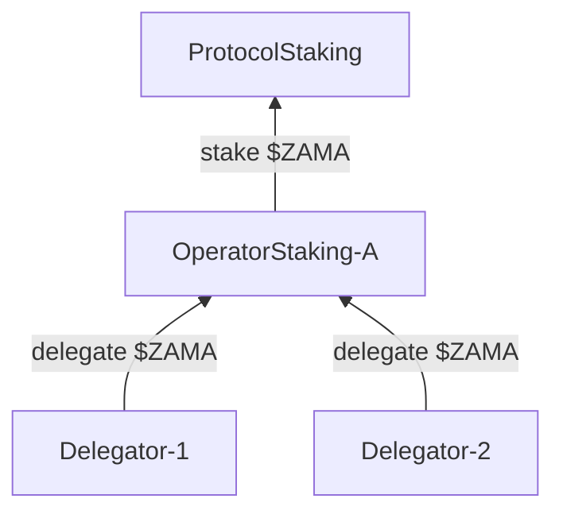
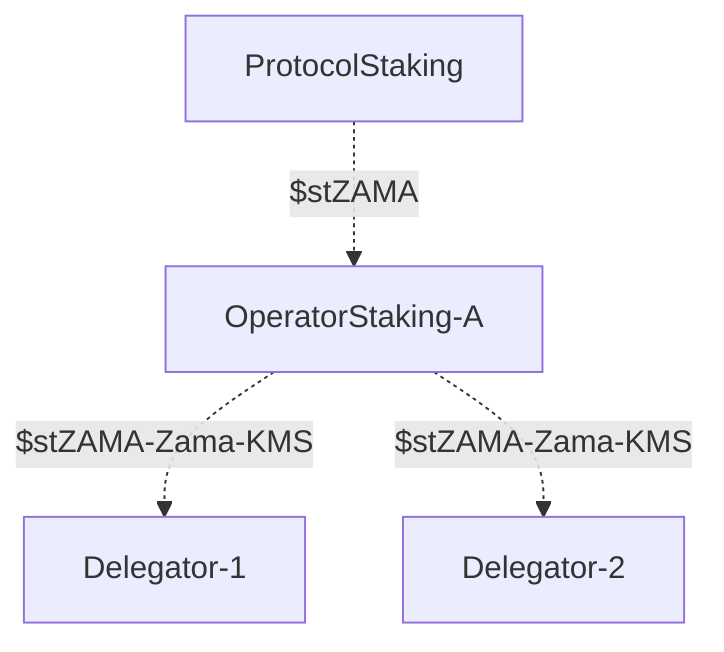
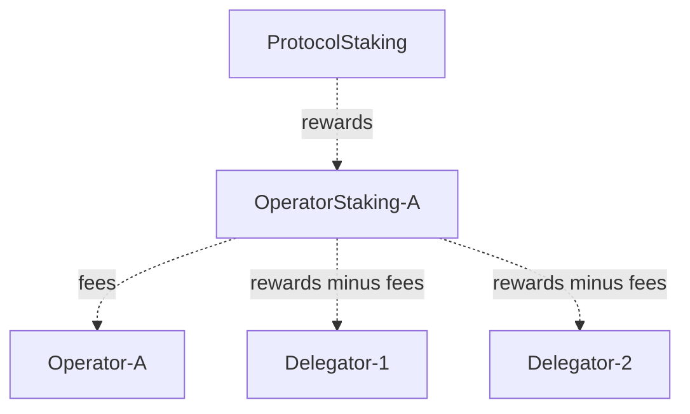

# Staking

The Zama Protocol secures itself by allowing $ZAMA token holders to delegate on operators, incentivising them to run its core components: KMS nodes and Coprocessors. More information in the [FHEVM litepaper documentation](https://docs.zama.org/protocol/zama-protocol-litepaper).

## Terminology

* **Protocol Staking Contract**: The root contract in the hierarchy where operators stake $ZAMA on the protocol.
* **Operator Staking Contract**: A contract deployed per operator that pools $ZAMA from the operator and their delegators to stake in the Protocol Staking contract.
* **Operator Rewarder Contract**: A contract associated with each Operator Staking contract, responsible for distributing staking rewards and commission fees to delegators and operators, respectively.
* **Operator**: An entity that runs at least one Zama Protocol node (KMS or Coprocessor) and receives staking commission fees in compensation. More info about operators in the [litepaper documentation](https://docs.zama.org/protocol/zama-protocol-litepaper#components).
* **Delegator**: A token holder who delegates their $ZAMA into an Operator Staking contract to earn staking rewards.
* **Beneficiary**: The address authorized by an operator to manage their Operator Rewarder contract (e.g., set commission rates, claim and receive accumulated fees).
* **Staking Rewards**: Yields accumulated in the Protocol Staking contract that are distributed to delegators through the Operator Rewarder contract.
* **Commission Fee**: The percentage cut of the Staking Rewards taken by the operator as payment for their services. The commission fee is set by the operator with a maximum of 20%.
* **Owner**: The owner of all staking contracts, holding several administrative rights. For mainnet, the owner is the [Protocol DAO governance](governance.md).

## Contract addresses

All deployed staking contract addresses can be found in the [ethereum addresses directory](addresses/mainnet/ethereum.md) for mainnet and the [sepolia addresses directory](addresses/testnet/sepolia.md) for testnet.

## Overview

Staking in the Zama protocol happens in a two level hierarchy:

* Operator pools stake $ZAMA on the protocol
* Token holders delegate $ZAMA to operator pools to stake on their behalf

Anyone can stake on the protocol, but only the elected operators receive commission fees, and only the delegators on elected operators receive staking rewards. Operators are chosen multiple times per year via governance and have a responsibility to participate in the daily execution of the protocol.


All staking happens on Ethereum. Only non-confidential $ZAMA is supported for now.


### Structure

The hierarchy is implemented by a [Protocol Staking contract](#contract-protocolstaking) and an [Operator Staking contract](#contract-operatorstaking). The Protocol Staking contract is at the root, and one Operator Staking contract is deployed per operator. An accompying [Operator Rewarder contract](#contract-operatorrewarder) is deployed for each Operator Staking contract, and this Operator Rewarder contract is responsible for paying out commission fees and staking rewards.


```mermaid
flowchart TB
    ProtocolStaking --- OperatorStaking-A --- OperatorRewarder-A
    ProtocolStaking --- OperatorStaking-B --- OperatorRewarder-B
```

#### Staking domains

The protocol uses two distinct yet structurally identical staking ecosystems for the KMS and coprocessor operators. Tokens delegated to a KMS operator only earn from the KMS reward pool and are governed by the specific KMS staking contracts, while tokens delegated to a coprocessor operator earn from the coprocessor reward pool and are governed by the coprocessor staking contracts.


```mermaid
flowchart TD
    %% KMS Branch
    KPS([Key Management Service ProtocolStaking]) --- KOP_A[OperatorStaking-A]
    KPS --- KOP_B[OperatorStaking-B]
    
    %% Coprocessor Branch
    CPS([Coprocessor ProtocolStaking]) --- COP_A[OperatorStaking-C]
    CPS --- COP_B[OperatorStaking-D]
```

The global protocol inflation rate is distributed between these domains according to a fixed ratio set by Protocol DAO governance. See [Calculating the rewards rate](#calculating-the-rewards-rate) for more information.

### Staking and delegating

The Operator Staking contracts are used by token holders to delegate $ZAMA on the protocol, and token holders may delegate to multiple Operator Staking contracts at the same time.


```mermaid


flowchart BT
    OperatorStaking-A -- stake $ZAMA --> ProtocolStaking
    Delegator-1 -- delegate $ZAMA --> OperatorStaking-A
    Delegator-2 -- delegate $ZAMA --> OperatorStaking-A
```

In return, the Operator Staking contract obtains [protocol staking shares](#protocol-staking-token), and the delegator obtains [operator staking shares](#operator-staking-token). The operator staking shares use the `$stZAMA-OperatorName-Domain` naming convention. In the diagram below these are `$stZAMA` and `$stZAMA-Zama-KMS`, respectively.


```mermaid
flowchart TB
    ProtocolStaking -. $stZAMA .-> OperatorStaking-A
    OperatorStaking-A -. $stZAMA-Zama-KMS .-> Delegator-1
    OperatorStaking-A -. $stZAMA-Zama-KMS .-> Delegator-2
```

The operator staking shares are liquid and unique for each Operator Staking contract, while the protocol staking shares are not liquid, meaning they can only be redeemed for $ZAMA by the Operator Staking contract.

### Fees and rewards

The Protocol Staking contracts are continuously distributing staking rewards to the Operator Staking contracts. Operators are entitled to a commission fee on the rewards, and the rest is distributed to the delegators. All commission fees and staking rewards are paid in $ZAMA.


```mermaid


flowchart TB
    ProtocolStaking -. rewards .-> OperatorStaking-A
    OperatorStaking-A -. fees .-> Operator-A
    OperatorStaking-A -. rewards minus fees .-> Delegator-1
    OperatorStaking-A -. rewards minus fees .-> Delegator-2
```

The commission fee percentage is independently set (within the maximum allowed by [Protocol DAO governance](governance.md)) for each Operator Staking contract by the assigned operator.

## Quick Start



Many common staking operations can be performed through the Zama staking dashboard. See the [Zama apps](./apps.md) page.



### Delegate $ZAMA

Delegating $ZAMA to an operator is a two-step process. First, you must approve the `OperatorStaking` contract to spend your tokens, and then you call the `deposit` function to mint operator staking shares.

```solidity
// 1. Approve the OperatorStaking contract to spend your $ZAMA

bool approvalSuccess = zamaToken.approve(operatorStakingAddress, amountToDelegate);

// 2. Deposit (Delegate) the $ZAMA

// amountToDelegate: amount of assets to deposit.
// receiver: address to receive the minted operator staking shares.
// shares: amount of operator staking shares minted.

uint256 shares = operatorStaking.deposit(amountToDelegate, receiver);
```

### Claim staking rewards

First, fetch the `OperatorRewarder` contract from the `OperatorStaking` address:

```solidity
address rewarderAddress = operatorStaking.rewarder();
```

Once you have the `OperatorRewarder` address, you can call `claimRewards(receiver)` to claim your pending rewards. All rewards are paid out in $ZAMA tokens directly to the receiver.

```solidity
IOperatorRewarder(rewarderAddress).claimRewards(receiver);
```

#### Set rewards claimer

A **claimer** is an address authorized to invoke the `claimRewards` function on behalf of a delegator. This role is useful for delegators who wish to transfer the responsibility of claiming rewards to another address without compromising security. For example, a delegator may set a smart contract as the claimer that automatically claims rewards as part of a broader yield strategy.

A delegator can have only one authorized claimer at any given time. If no claimer is explicitly set, the delegator address is considered its own authorized claimer by default.

To authorize an address to claim rewards on your behalf, call `setClaimer` on the `OperatorRewarder` contract with the address you wish to authorize to claim your rewards:

```solidity
IOperatorRewarder(rewarderAddress).setClaimer(claimerAddress);
```

### Claim commission fees

Operators can claim their accumulated commission fees from their `OperatorRewarder` contract. Only the [beneficiary](#operatorrewarder-beneficiary) set in the contract can claim the fees, and the fees are sent directly to the beneficiary.

```solidity
IOperatorRewarder(rewarderAddress).claimFee();
```

### Redeem shares

Redeeming from `OperatorStaking` contracts is a two-step process subject to a cooldown period (determined by the `ProtocolStaking` contract). The period is currently set to 7 days on mainnet (3 minutes on testnet) and is updatable by the owner. Note that `OperatorStaking` contract shares are transferable (as ordinary ERC20), and hence offer an alternative “withdrawal" process without being subject to the cooldown period.

All redemption requests are managed by a controller. See [The controller](#the-controller) for more information.

Also note that all operator staking shares use 20 decimals. See [Operator Staking decimals](#operator-staking-decimals) for more information.

```solidity
// 1. Request redeem

// shares: amount of shares to redeem.
// controllerAddress: the address that will manage this withdrawal (can be msg.sender)
// ownerAddress: the owner of the shares.
// releaseTime: the timestamp when the assets will be available for withdrawal.

uint48 releaseTime = operatorStaking.requestRedeem(shares, controllerAddress, ownerAddress);

// Wait for the cooldown period to pass

// 2. Redeem

// shares: amount of shares to redeem (use max uint256 for all claimable).
// receiverAddress: the address to receive the assets.
// controllerAddress: the same address used in step 1.

uint256 assetsReceived = operatorStaking.redeem(shares, receiverAddress, controllerAddress);
```

## Contract: ProtocolStaking

The `ProtocolStaking` contract acts as the root of the hierarchy where operators stake their pooled $ZAMA.

### Protocol Staking shares

The `ProtocolStaking` contract issues a share token to acknowledge the amount of $ZAMA staked by an operator. There are two separate protocol staking share tokens, one for each of the deployed KMS and coprocessor `ProtocolStaking` contracts:

* `$stZAMA-KMS`
* `$stZAMA-Coprocessor`

These tokens use 18 decimals and are non-transferable.

#### Staked token weight

The `ProtocolStaking` contract implements a non-linear weight system to determine reward distribution. Unlike linear staking models where rewards scale 1:1 with staked assets, `ProtocolStaking` utilizes a concave weighting function to prioritize protocol decentralization. The weight assigned to an operator is calculated as the square root of its staked balance:

```solidity
stakedAmount = ProtocolStaking.balanceOf(operator)
weight = Math.sqrt(stakedAmount)
```

This weighting system incentivizes broader participation and reduces the impact of large token holders on the reward distribution.

### Protocol Staking owner

The `ProtocolStaking` contract owner acts as the owner of the entire staking hierarchy. This owner is set on contract deployment, and the ownership authority is propagated to `OperatorStaking` contracts and `OperatorRewarder` contracts.

The owner is not the same as the `MANAGER_ROLE` on the `ProtocolStaking` contract. The `MANAGER_ROLE` is a separate role that can be granted to other addresses to perform specific [management functions](#manager-functions), such as updating the unstake cooldown period and reward rate.

### Operator eligibility

It is important to note that only _eligible_ `OperatorStaking` contracts generate rewards when staking into the `ProtocolStaking` contract. Requesting eligibility is a manual process ending with a protocol governance proposal. As part of the process, operators are asked to run to run at least one Zama Protocol node (KMS or Coprocessor).

### User functions

Non-role-restricted public functions on `ProtocolStaking` are not intended for direct use. They should only be called by `OperatorStaking` contracts.

### Manager functions

The `MANAGER_ROLE` is granted to the [Protocol DAO governance](governance.md) on mainnet. The following functions require the caller to have the `MANAGER_ROLE` set on the contract:

#### Manage eligible accounts

Manages which addresses are currently eligible to earn global rewards from the protocol (e.g., `OperatorStaking` contracts). Anyone can call `stake()` on the `ProtocolStaking` contract, but only eligible accounts will actually earn rewards on their staked tokens.

When an account's eligibility is added or removed, the contract automatically snapshots that account's reward state. This ensures that rewards are only accrued for the exact duration the account was eligible.

```solidity
// Add an eligible account
protocolStaking.addEligibleAccount(operatorAddress);

// Remove an eligible account
protocolStaking.removeEligibleAccount(operatorAddress);
```

#### Set reward rate

Adjusts the global tokens-per-second reward rate distributed among all eligible pools.

This function snapshots the current global reward state, ensuring that the old rate is accurately applied to all rewards earned up to the calling point, and the new rate only applies to rewards generated from this point forward.

```solidity
protocolStaking.setRewardRate(newRewardRate);
```

#### Set unstake cooldown period

Updates the mandatory waiting period between unstaking and releasing tokens. Existing unstake requests are unaffected. Note that since release times are strictly increasing per account, reducing the cooldown period only takes full effect once an account's previous, longer cooldowns have elapsed.

```solidity
protocolStaking.setUnstakeCooldownPeriod(newCooldownPeriod);
```

### View functions

#### Get earned rewards

Returns the amount of $ZAMA rewards currently accrued for an account that are available to be claimed. The `accountAddress` must be an [eligible](#operator-eligibility) account, otherwise, this function will always return 0.

```solidity
uint256 rewards = protocolStaking.earned(accountAddress);
```

#### Get staking token

Returns the address of the $ZAMA token used for staking and rewards.

```solidity
address token = protocolStaking.stakingToken();
```

#### Get staking weight

Returns the square-root weight for a given token amount. Used in the reward distribution calculation.

See [Staked token weight](#staked-token-weight) for more information.

```solidity
uint256 w = protocolStaking.weight(amount);
```

#### Get total staked weight

Returns the total eligible staked weight across all active operator pools.

```solidity
uint256 totalWeight = protocolStaking.totalStakedWeight();
```

#### Get unstake cooldown period

Returns the current cooldown period in seconds.

```solidity
uint256 cooldown = protocolStaking.unstakeCooldownPeriod();
```

#### Get awaiting release

Returns the total amount of unstaked tokens still pending release for an account. This includes tokens still in the cooldown period and tokens whose cooldown has already elapsed but have not yet been released via `release()`.

```solidity
uint256 pending = protocolStaking.awaitingRelease(accountAddress);
```

#### Get reward rate

Returns the current reward rate in $ZAMA tokens distributed per second across all eligible pools.

```solidity
uint256 rate = protocolStaking.rewardRate();
```

#### Get rewards recipient

Returns the configured recipient address for an account's rewards. If not set, returns the account address itself. A rewards recipient can be set via [setRewardsRecipient()](#set-rewards-recipient).

```solidity
address recipient = protocolStaking.rewardsRecipient(accountAddress);
```

#### Check account eligibility

Returns `true` if an account has the `ELIGIBLE_ACCOUNT_ROLE` and will earn rewards.

```solidity
bool eligible = protocolStaking.isEligibleAccount(accountAddress);
```

#### Get owner

Returns the owner address. See [Protocol Staking owner](#protocol-staking-owner) for more information.

```solidity
address protocolOwner = protocolStaking.owner();
```

### Events

| Event | Description |
| ----- | ----------- |
| `RewardRateSet(rewardRate)` | Emitted when the global token rewards rate is updated. |
| `RewardsClaimed(account, recipient, amount)` | Emitted when an operator pool claims rewards. |
| `RewardsRecipientSet(account, recipient)` | Emitted when a staker's reward recipient is updated. |
| `TokensReleased(recipient, amount)` | Emitted when tokens are released to a recipient after the unstaking cooldown period. |
| `TokensStaked(account, amount)` | Emitted when $ZAMA is staked into the protocol. |
| `TokensUnstaked(account, amount, releaseTime)` | Emitted when an unstake is requested, initiating the cooldown. |
| `UnstakeCooldownPeriodSet(unstakeCooldownPeriod)` | Emitted when the owner adjusts the unstaking waiting period. |

### Errors

| Error | Cause |
| ----- | ----- |
| `InvalidEligibleAccount(account)` | The zero address was attempted to be added to the eligible accounts list. |
| `InvalidUnstakeCooldownPeriod()` | The requested cooldown period is invalid. |
| `TransferDisabled()` | An attempt was made to transfer to or from the zero address. |

## Contract: OperatorStaking

The `OperatorStaking` contract serves as a dedicated staking pool for a specific network operator. It enables delegators to pool their $ZAMA tokens, which are then collectively staked into the `ProtocolStaking` contract to earn rewards.

### Operator Staking shares

Each operator has their own `OperatorStaking` instance acting as an [ERC4626](https://eips.ethereum.org/EIPS/eip-4626)-compliant vault. When users delegate $ZAMA, they receive operator-specific staking shares representing their proportional ownership of the pool's assets and future rewards. These token shares are fully transferable and use 20 decimals. 

#### Operator Staking decimals

To mitigate the well-known ERC4626 inflation attack, the `OperatorStaking` contract implements a decimal offset of 2. This means that 1 unit of the underlying asset is represented as 100 units of shares. 

Because the underlying staked asset ($ZAMA) has 18 decimals, the resulting operator staking shares will always possess 20 decimals. When interacting with the contracts or calculating balances, it is important to remember this distinction. 

For example, when looking at the total stake of a pool or calculating historical rewards across different contracts:
* Calling `totalSupply()` on an `OperatorStaking` contract returns the total pool shares in the form of virtual shares. If the value returned is **100 * 10^20**, this equates to 100 `$stZAMA-Zama-KMS` shares because the shares use 20 decimals.

### The controller

`OperatorStaking` decouples share ownership from withdrawal management. This is handled via the **controller** role.

Every redemption request is tracked against a controller address rather than the share owner. This allows a user to delegate the administrative task of "watching the cooldown" to a separate address (like a hot wallet or a bot) without giving that address full control over their shares.

#### Authorize redemption operator

A controller can further delegate their power by calling `setOperator()`. An authorized operator can call the `redeem()` function on behalf of the controller.

```solidity
// msg.sender (the controller) authorizes operatorAddress
operatorStaking.setOperator(operatorAddress, true);
```

### User functions

#### Delegate (deposit)

Delegates $ZAMA tokens to the operator pool, minting staking shares proportional to the deposit. 

See [Delegate $ZAMA](#delegate-zama) in the Quick Start guide.

#### Delegate with permit

Combines an [EIP-2612](https://eips.ethereum.org/EIPS/eip-2612) approval with delegation into a single transaction.

```solidity
uint256 shares = operatorStaking.depositWithPermit(assets, receiver, deadline, v, r, s);
```

#### Request redeem

Initiates the first step of the two-step unstaking process. Burns the specified shares and starts the cooldown timer. Returns the timestamp when the assets will be claimable. 

See [Redeem shares](#redeem-shares) in the Quick Start guide.

#### Redeem

Completes a redemption after the cooldown has passed. Must be called by the [controller](#the-controller) (or an authorized operator). Pass `type(uint256).max` to redeem all claimable shares.

See [Redeem shares](#redeem-shares) in the Quick Start guide.

#### Stake excess

Restakes any excess liquid $ZAMA held by the `OperatorStaking` contract back into the `ProtocolStaking` contract. Excess tokens can accumulate from direct $ZAMA donations or transfers to the contract, or from unredeemed slashed positions.


Note that slashing has not been implemented yet on the protocol.


```solidity
operatorStaking.stakeExcess();
```

### Owner functions

#### Set rewarder

Replaces the linked `OperatorRewarder` contract. This is a multi-step process handled internally by the `OperatorStaking` contract:

1. **Shutdown old rewarder**: The current `OperatorRewarder` is shut down, preventing future reward distributions from the old contract and allowing for final state snapshots.
2. **Update recipient**: The `ProtocolStaking` contract's `setRewardsRecipient` function is called to redirect all future $ZAMA rewards to the new rewarder contract.
3. **Start new rewarder**: Finally, the new `OperatorRewarder` is initialized via its `start()` function to begin tracking and distributing rewards.

```solidity
operatorStaking.setRewarder(newRewarderAddress);
```

### View functions

#### Get asset

Returns the address of the underlying staking asset ($ZAMA).

```solidity
address stakingAsset = operatorStaking.asset();
```

#### Get ProtocolStaking

Returns the address of the linked `ProtocolStaking` contract.

```solidity
address protocolStakingAddr = address(operatorStaking.protocolStaking());
```

#### Get rewarder

Returns the address of the currently linked `OperatorRewarder` contract.

```solidity
address rewarderAddr = operatorStaking.rewarder();
```

#### Get owner

Returns the owner address (inherited from `ProtocolStaking`).

```solidity
address protocolOwner = operatorStaking.owner();
```

#### Get total assets

Returns the total $ZAMA managed by this pool, including staked, liquid, and awaiting-release balances.

```solidity
uint256 total = operatorStaking.totalAssets();
```

#### Get pending redeem request

Returns the number of shares still not yet eligible for redemption in the cooldown queue for a given controller.

```solidity
uint256 pending = operatorStaking.pendingRedeemRequest(controllerAddress);
```

#### Get claimable redeem request

Returns the number of shares whose cooldown has elapsed and are now redeemable for a given controller, minus any shares already redeemed.

```solidity
uint256 claimable = operatorStaking.claimableRedeemRequest(controllerAddress);
```

#### Get total shares in redemption

Returns the total number of shares across all in-flight redemption requests.

```solidity
uint256 inFlight = operatorStaking.totalSharesInRedemption();
```

#### Preview deposit

Returns the number of shares that would be minted for a given deposit amount.

```solidity
uint256 shares = operatorStaking.previewDeposit(assets);
```

#### Preview redeem

Returns the amount of $ZAMA that would be received when redeeming a given number of shares.

```solidity
uint256 assets = operatorStaking.previewRedeem(shares);
```

#### Check operator approval

Returns `true` if `operator` is authorized to manage redemptions for `controller`.

```solidity
bool approved = operatorStaking.isOperator(controller, operator);
```

#### Get decimals

Returns the number of decimals for the share token. Always returns `20` due to the ERC4626 decimal offset.

```solidity
uint8 shareDecimals = operatorStaking.decimals();
```

### Events

| Event | Description |
| ----- | ----------- |
| `OperatorSet(controller, operator, approved)` | Emitted when an operator approval is set for a controller. |
| `RedeemRequest(controller, owner, sender, shares, assets, releaseTime)` | Emitted when a user requests to redeem shares. |
| `RewarderSet(oldRewarder, newRewarder)` | Emitted when the Operator Rewarder contract is changed. |

### Errors

| Error | Cause |
| ----- | ----- |
| `CallerNotProtocolStakingOwner(caller)` | The caller is not the owner of the contract. |
| `InvalidController()` | The controller address is zero. |
| `InvalidRewarder(rewarder)` | The new rewarder address is invalid. |
| `InvalidShares()` | The number of shares to redeem or request redemption is zero. |
| `NoExcessBalance(liquidBalance, assetsPendingRedemption)` | The liquid asset balance is insufficient to cover pending redemptions in `stakeExcess()`. |
| `Unauthorized()` | The caller to the redeem function is not the controller or an operator set by the controller. |

## Contract: OperatorRewarder

The `OperatorRewarder` handles the distribution of rewards and the claiming of operator commission fees. Every `OperatorStaking` pool has one corresponding `OperatorRewarder` contract, and the owner has the authority to set the rewarder contract for any `OperatorStaking` contract.

### OperatorRewarder beneficiary

The beneficiary of an `OperatorRewarder` contract is the address that can set and claim fees. The beneficiary is set on the deployment of the `OperatorRewarder` contract and can be changed by the owner through the [transferBeneficiary()](#transfer-beneficiary) function.

To find the beneficiary of an `OperatorRewarder` contract, you can use the [beneficiary()](#get-beneficiary) view function.

An `OperatorRewarder` beneficiary has the authority to change the fee percentage for the associated contract through the [setFee()](#set-commission-fee) function. The fee percentage is set in basis points, where 10000 is 100%. Note that fees are subject to a maximum of 20% (2000 basis points) set by the owner.

If an operator wants to receive "regular" staking rewards in addition to their commission fee, they can simply act as a delegator by staking assets into their own `OperatorStaking` contract. They would then receive both:
* The **Commission Fee** on the pool's total generated rewards.
* The **Proportional Reward** for the assets they personally staked.

### User functions

#### Claim rewards

See [Claim staking rewards](#claim-staking-rewards) in the Quick Start guide for full details.

#### Set rewards claimer

See [Set rewards claimer](#set-rewards-claimer) in the Quick Start guide for full details.

### Beneficiary functions

The following functions are callable only by the [beneficiary](#operatorrewarder-beneficiary) of the `OperatorRewarder` contract:

#### Claim commission fee

See [Claim commission fee](#claim-commission-fee) in the Quick Start guide for full details.

#### Set commission fee

Updates the commission fee taken from delegator rewards. The new fee cannot exceed the `maxFeeBasisPoints` set by the owner. 

Before updating the fee, the contract internally claims all currently accrued fees held by the contract to the beneficiary address.

```solidity
// Sets the fee to 10% (1000 basis points)
operatorRewarder.setFee(1000);
```

### Owner functions

The following functions are callable only by the owner of the `OperatorRewarder` contract:

#### Set maximum fee

Updates the maximum commission fee the beneficiary is allowed to set. If the new maximum is lower than the current fee, then the current fee is automatically adjusted down and unpaid fees are claimed to the beneficiary.

```solidity
// Sets the max fee to 20% (2000 basis points)
operatorRewarder.setMaxFee(2000);
```

#### Transfer beneficiary

Transfers the beneficiary role to a new address. Does not automatically claim unpaid fees for the outgoing beneficiary, allowing for the recovery of any unpaid fees in the event that a beneficiary account is compromised or lost.

```solidity
operatorRewarder.transferBeneficiary(newBeneficiaryAddress);
```

### View functions

#### Get fee basis points

Returns the current commission fee percentage applied to delegator rewards.

```solidity
// Returns the current fee in basis points (e.g., 1000 = 10%)
uint16 currentFee = operatorRewarder.feeBasisPoints();
```

#### Get maximum fee basis points

Returns the maximum fee percentage the beneficiary is allowed to set.

```solidity
uint16 maxFee = operatorRewarder.maxFeeBasisPoints();
```

#### Get unpaid fee

Returns the total amount of unclaimed $ZAMA commission fees accumulated for the beneficiary.

```solidity
uint256 unpaid = operatorRewarder.unpaidFee();
```

#### Get earned rewards

Returns the amount of $ZAMA rewards accrued by a delegator that are available to be claimed.

```solidity
uint256 pending = operatorRewarder.earned(delegatorAddress);
```

#### Get historical reward

Returns the cumulative total of all rewards generated by this pool since the rewarder was started, net of unpaid fees. This is computed as the sum of:

* The rewarder's current $ZAMA token balance.
* Rewards earned by the pool from `ProtocolStaking` but not yet claimed.
* All rewards already paid out to delegators.

minus the unpaid fee portion owed to the beneficiary.

```solidity
uint256 historical = operatorRewarder.historicalReward();
```

#### Get owner

Returns the owner address (inherited from `ProtocolStaking`).

```solidity
address protocolOwner = operatorRewarder.owner();
```

#### Get beneficiary

Returns the current beneficiary address.

```solidity
address beneficiaryAddr = operatorRewarder.beneficiary();
```

#### Get claimer

Returns the authorized claimer for a given receiver address. If no claimer is set, the receiver address itself is returned.

```solidity
address authorizedClaimer = operatorRewarder.claimer(receiverAddress);
```

#### Get token

Returns the staking token ($ZAMA) address.

```solidity
IERC20 stakingToken = operatorRewarder.token();
```

#### Get ProtocolStaking

Returns the address of the linked `ProtocolStaking` contract.

```solidity
address protocolStakingAddr = address(operatorRewarder.protocolStaking());
```

#### Get OperatorStaking

Returns the address of the linked `OperatorStaking` contract.

```solidity
address operatorStakingAddr = address(operatorRewarder.operatorStaking());
```

#### Check started

Returns `true` if the rewarder has been started and is accepting reward claims.

```solidity
bool started = operatorRewarder.isStarted();
```

#### Check shutdown

Returns `true` if the rewarder has been shut down, meaning it no longer computes new rewards from the `ProtocolStaking` contract.

```solidity
bool shutdown = operatorRewarder.isShutdown();
```

### Events

| Event | Description |
| ----- | ----------- |
| `BeneficiaryTransferred(oldBeneficiary, newBeneficiary)` | Emitted when the beneficiary is updated. |
| `ClaimerAuthorized(receiver, claimer)` | Emitted when a delegator authorizes another address to claim their rewards. |
| `FeeClaimed(beneficiary, amount)` | Emitted when commission fees are claimed. |
| `FeeUpdated(oldFee, newFee)` | Emitted when the commission fee is changed. |
| `MaxFeeUpdated(oldFee, newFee)` | Emitted when the maximum allowed fee is changed by the owner. |
| `RewardsClaimed(receiver, amount)` | Emitted when a delegator claims their rewards. |
| `Shutdown()` | Emitted when the `OperatorRewarder` is shut down by the owner, preventing future rewards distribution. |

### Errors

| Error | Cause |
| ----- | ----- |
| `AlreadyShutdown()` | Attempted an action, but the rewarder is already shut down. |
| `AlreadyStarted()` | Attempted to start a rewarder that has already been started. |
| `BeneficiaryAlreadySet(beneficiary)` | The new beneficiary is identical to the current one. |
| `CallerNotBeneficiary(caller)` | The caller is not the authorized beneficiary. |
| `CallerNotOperatorStaking(caller)` | The caller is not the linked `OperatorStaking` contract. |
| `CallerNotProtocolStakingOwner(caller)` | The caller is not the owner of the `ProtocolStaking` contract. |
| `ClaimerAlreadySet(receiver, claimer)` | The new claimer is identical to the current one. |
| `ClaimerNotAuthorized(receiver, claimer)` | The caller does not have permission to claim on behalf of the delegator. |
| `FeeAlreadySet(feeBasisPoints)` | The new fee is identical to the current one. |
| `InvalidBasisPoints(basisPoints)` | The basis points input is out of bounds (e.g., above 10000). |
| `InvalidBeneficiary(beneficiary)` | The provided beneficiary address is zero. |
| `InvalidClaimer(claimer)` | The provided claimer address is zero. |
| `MaxBasisPointsExceeded(basisPoints, maxBasisPoints)` | The new fee exceeds the maximum set by the owner. |
| `MaxFeeAlreadySet(maxFeeBasisPoints)` | The new maximum fee is identical to the current one. |
| `NotStarted()` | Attempted an action, but the rewarder hasn't been started yet. |

## Staking rewards calculation

> [!TIP]
> For a full interactive walkthrough with example outputs, see the [APY notebook](../contracts/staking/APY.ipynb).

### Calculating the rewards rate

The rewards rate is defined as tokens-per-second and is determined as follows:

1. The total yearly rewards amount to be paid out is determined once a year as a percentage of the current total supply of $ZAMA. This percentage (`TOTAL_YEARLY_INFLATION_PROPORTION`) is **a variable controlled by the Protocol DAO governance** and is currently set to **5%**.
2. This total amount is divided between the roles, with 40% going to coprocessor operators and 60% to KMS operators.
3. Each per role amount is converted into a per role tokens-per-second reward rate for the year.

```python
SECONDS_PER_YEAR = 365 * 24 * 60 * 60
TOTAL_SUPPLY = 11_000_000_000 * 10**18

def get_reward_rate(total_yearly_inflation_proportion: float) -> tuple[int, int]:
    """
    Compute the reward rates for KMS and Coprocessors based on total supply.

    :param total_yearly_inflation_proportion: Decimal value of the total yearly inflation (e.g. 0.05)
    :return: A tuple (rate_kms, rate_coprocessors) in tokens per second (with 18 decimals)
    """
    total_fees_rewards = int(TOTAL_SUPPLY * total_yearly_inflation_proportion)

    total_fees_rewards_kms = int(total_fees_rewards * 0.60)
    total_fees_rewards_coprocessors = int(total_fees_rewards * 0.40)

    rate_kms = total_fees_rewards_kms // SECONDS_PER_YEAR
    rate_coprocessors = total_fees_rewards_coprocessors // SECONDS_PER_YEAR

    return rate_kms, rate_coprocessors
```

### Calculating the APR

The native APR for delegating to an operator depends on several factors:

1. [**Reward Rate:**](#calculating-the-rewards-rate) The rate of tokens per second, retrieved from `ProtocolStaking.rewardRate()`.
2. **Tokens per Pool:** The number of deposited tokens in each eligible `OperatorStaking` pool, retrieved from `ProtocolStaking.balanceOf(address(OperatorStaking))`.
3. **Fees per Pool:** The commission fee for each corresponding `OperatorRewarder` in basis points, retrieved from `OperatorRewarder.feeBasisPoints()`.

```python
import math

SECONDS_PER_YEAR = 365 * 24 * 60 * 60

def compute_native_apr(
    reward_rate: int, 
    num_tokens_per_pool: list[int], 
    fees_per_pool: list[int]
) -> list[float]:
    """
    Compute the native APR for each eligible OperatorStaking pool.
    
    :return: List of percentage APRs for each pool
    """
    assert len(num_tokens_per_pool) == len(fees_per_pool), "Pool/Fee length mismatch"
    assert all(0 <= fee <= 10000 for fee in fees_per_pool), "Fees must be within 0 and 10000"
    assert all(0 <= tokens for tokens in num_tokens_per_pool), "Token amounts must be non-negative"
    assert reward_rate >= 0, "Reward rate must be non-negative"

    weights = [int(math.sqrt(tokens)) for tokens in num_tokens_per_pool]
    total_weight = sum(weights)
    
    fee_factors = [1 - (fee / 10000) for fee in fees_per_pool]
    rate_per_sec_per_pool = [reward_rate * (weight / total_weight) for weight in weights]
    
    pool_aprs = []
    for i in range(len(fee_factors)):
        net_reward_per_sec = rate_per_sec_per_pool[i] * fee_factors[i]
        pool_apr = (net_reward_per_sec / num_tokens_per_pool[i]) * SECONDS_PER_YEAR * 100
        pool_aprs.append(pool_apr)
    
    return pool_aprs
```

## Upgradability

The `ProtocolStaking` and `OperatorStaking` contracts are upgradeable using the **UUPS (Universal Upgradeable Proxy Standard)** with 2-step ownership transfer. Only the owner can upgrade these contracts.

The `OperatorRewarder` contract is not upgradeable.
