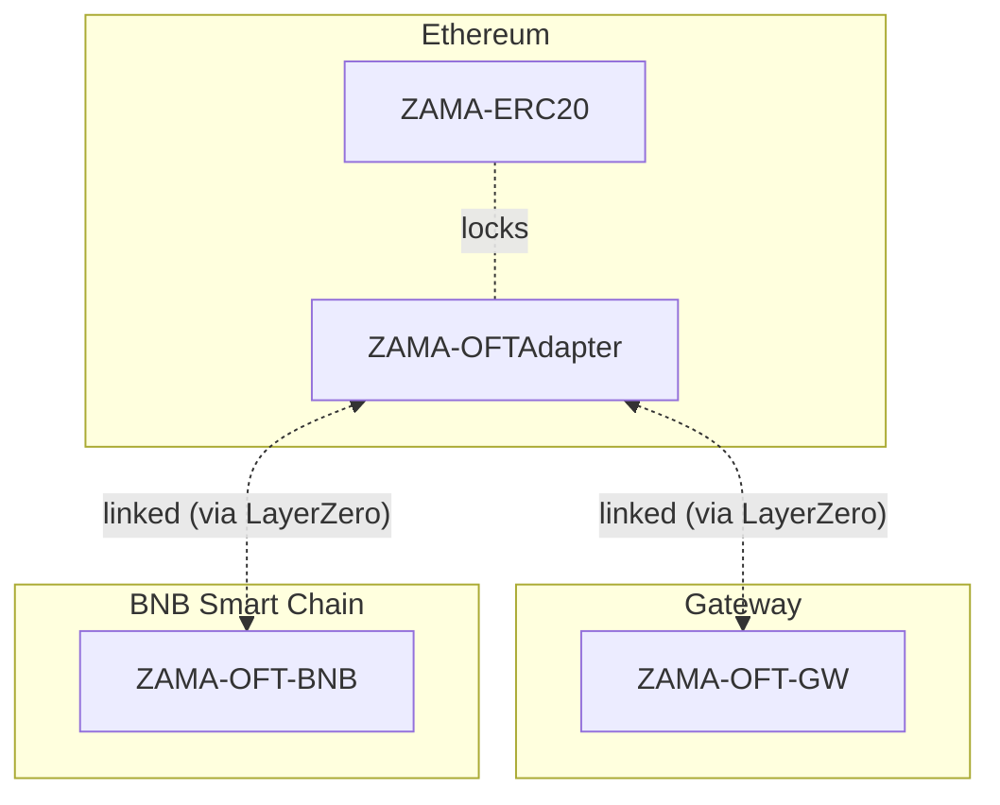

# $ZAMA Token

The Zama protocol uses to $ZAMA token as its utility token to pay for protocol operations such as decryptions. It is implemented as an ERC20 on Ethereum, and exposed on other chains as a LayerZero OFT.

## Bridge

The [Zama bridge](https://bridge.mainnet.zama.org/) is available as a LayerZero frontend to bridge $ZAMA between the chains on which it is deployed, including Ethereum and the Gateway.

The bridge may also be used to bridge ETH from Arbitrum One to the Gateway, to pay for gas fees on the latter.
