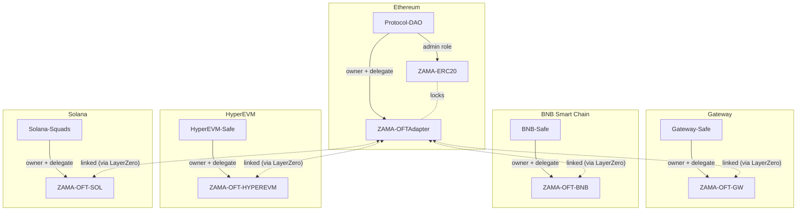

# $ZAMA Token

The Zama protocol uses to $ZAMA token as its utility token to pay for protocol operations such as decryptions. It is implemented as an ERC20 on Ethereum, and exposed on other chains as a LayerZero OFT.

## Contract addresses

All deployed token-related contract addresses can be found in the [addresses directory](addresses/README.md).

## OFT architecture

The primary token contract is the Zama ERC20 deployed on Ethereum. It is made available on other chains via LayerZero, as implemented via the OFT adapter on Ethereum and OFT contracts on each destination chain.

```mermaid
flowchart
    subgraph Ethereum
        Protocol-DAO
        ZAMA-ERC20
        ZAMA-OFTAdapter

        Protocol-DAO -- admin role --> ZAMA-ERC20
        Protocol-DAO -- owner + delegate --> ZAMA-OFTAdapter
        ZAMA-ERC20 -. locks .- ZAMA-OFTAdapter
    end

    subgraph Gateway
        Gateway-Safe
        ZAMA-OFT-GW

        Gateway-Safe -- owner + delegate --> ZAMA-OFT-GW
    end

    subgraph BNB Smart Chain
        BNB-Safe
        ZAMA-OFT-BNB

        BNB-Safe -- owner + delegate --> ZAMA-OFT-BNB
    end

    subgraph HyperEVM
        HyperEVM-Safe
        ZAMA-OFT-HYPEREVM

        HyperEVM-Safe -- owner + delegate --> ZAMA-OFT-HYPEREVM
    end

    subgraph Solana
        Solana-Squads
        ZAMA-OFT-SOL

        Solana-Squads -- owner + delegate --> ZAMA-OFT-SOL
    end

    ZAMA-OFTAdapter <-. linked (via LayerZero) .-> ZAMA-OFT-GW
    ZAMA-OFTAdapter <-. linked (via LayerZero) .-> ZAMA-OFT-BNB
    ZAMA-OFTAdapter <-. linked (via LayerZero) .-> ZAMA-OFT-HYPEREVM
    ZAMA-OFTAdapter <-. linked (via LayerZero) .-> ZAMA-OFT-SOL
```

Ownership of each OFT contract is detailed in [Governance](governance.md).

### Solana

On Solana, the token (SPL) and the bridge logic are split into different accounts. The token logic (used by exchanges and wallets) corresponds to the mint address, while the bridging logic and the LayerZero specific configuration are mainly inside the program and store addresses.

All Solana OFT addresses can be found in the [Solana mainnet addresses](addresses/mainnet/solana.md).

### Hyperliquid

The Hyperliquid bridge is a "double bridge": Ethereum <> HyperEVM <> HyperCore.

The HyperEVM OFT contract is linked to a [HIP-1](https://hyperliquid.gitbook.io/hyperliquid-docs/hyperliquid-improvement-proposals-hips/hip-1-native-token-standard) token instance on HyperCore.

The HIP-1 details are the following:

| HIP-1 metadata            | Value                              |
| ------------------------- | ---------------------------------- |
| name                      | ZAMA                               |
| szDecimals                | 2                                  |
| weiDecimals               | 8                                  |
| index                     | 433                                |
| tokenId                   | 0x93be47677e2dc084333dc6b59ac5672c |
| fullName                  | Zama                               |
| deployerTradingFeeShare   | 1.0                                |

To streamline the double-bridging process, a composer contract is deployed on HyperEVM (leveraging the [lzCompose](https://docs.layerzero.network/v2/developers/evm/composer/overview) pattern). This allows users to bridge in a single step directly from Ethereum to HyperCore, by sending tokens to the composer contract on HyperEVM with correct lzCompose options. This is abstracted away via the dedicated bridge frontend (see [Bridges](#bridges)).


Before bridging to HyperCore, users should ensure they have activated their account on HyperCore as a prerequisite. This could be done for instance via the [Hyperliquid UI](https://app.hyperliquid.xyz/trade) and depositing 10 USDC to their address via the official Arbitrum bridge. Another method is by letting another already active account send them 1 USDC via the Hyperliquid UI (be aware that this amount will be burned).


All HyperEVM contract addresses (OFT + composer) can be found in the [HyperEVM mainnet addresses](addresses/mainnet/hyper_evm.md).

## Bridges

The [Zama bridge](https://bridge.mainnet.zama.org/) is available as a LayerZero frontend to bridge $ZAMA between the chains on which it is deployed, including Ethereum and the Gateway.

The bridge may also be used to bridge ETH from Arbitrum One to the Gateway, to pay for gas fees on the latter.

### $ZAMA bridges

* Main bridge: [https://bridge.zama.org/](https://bridge.zama.org/) (using Superbridge)
  - Ethereum <> Gateway
  - Ethereum <> BSC
  - Ethereum <> Solana
* HyperLiquid bridge: [https://stargate.finance/](https://stargate.finance/?srcChain=ethereum&srcToken=0xA12CC123ba206d4031D1c7f6223D1C2Ec249f4f3&dstChain=hypercore&dstToken=0x93be47677e2dc084333dc6b59ac5672c) (using Stargate)
  - Ethereum -> HyperCore
  - HyperCore -> HyperEVM
  - Ethereum <> HyperEVM

### $ETH bridges

* Main bridge: [https://bridge.zama.org/](https://bridge.zama.org/) (using Superbridge)
  - Arbitrum One <> Gateway
* Arbitrum One bridge: [https://portal.arbitrum.io/bridge](https://portal.arbitrum.io/bridge?destinationChain=arbitrum-one&sanitized=true&sourceChain=ethereum)
  - Ethereum <> Arbitrum One