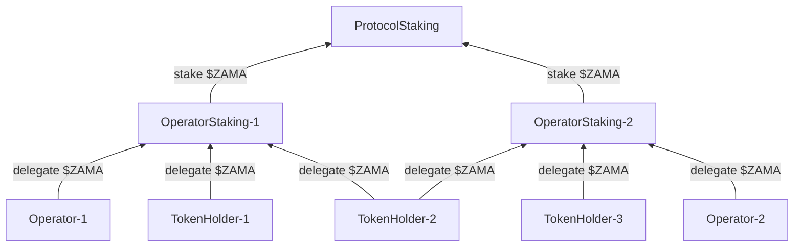
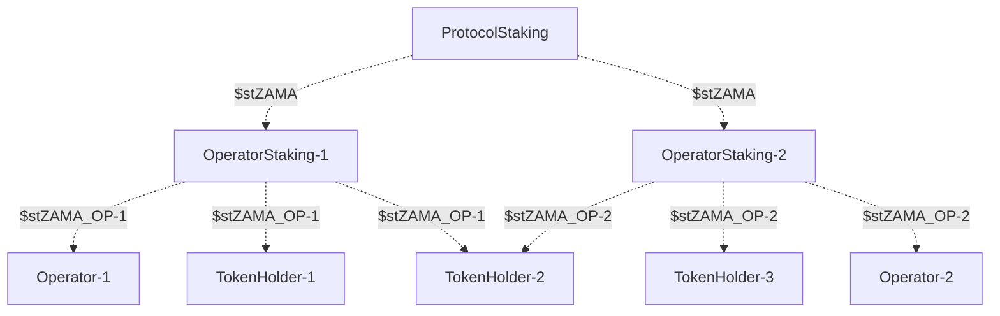
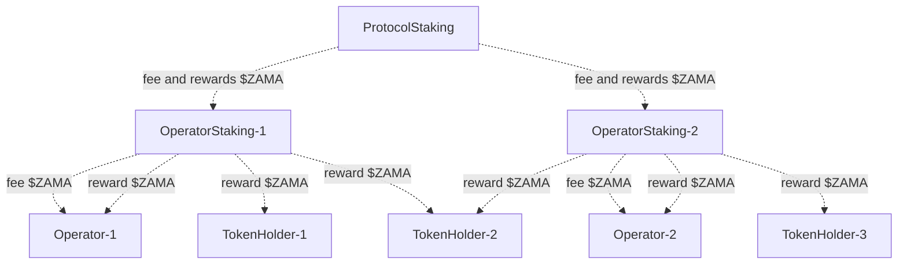

# Staking

This document describes how staking works in the Zama protocol from an operator’s perspective.

## Overview

Staking in the Zama protocol happens in a two level hierarchy:

* token holders delegate stake to operators
* operators stake on the protocol.

Anyone can stake on the protocol, but only the elected operators are granted fees and rewards as a result of having a responsibility to participate in the daily operations of the protocol. Elected operators are chosen multiple times per year via governance.

The hierarchy is deployed once for each operator role in the protocol, meaning that there is one protocol staking contract for coprocessors and one for KMS nodes, and likewise a set of operator staking contracts for coprocessors and a set for KMS nodes. These hierarchies are disjunct and unconnected. If an operator is operating as both a coprocessor and a KMS node, then that operator has two operator staking contracts that independent stake on the coprocessor protocol staking contract and on the KMS protocol staking contract.


All staking happens on **Ethereum**. Only non-confidential $ZAMA is supported for now.


## Wallet

Each operator is expected to have an `OPERATOR` address that will be used as the owner of their staking contract(s). Below we explain other uses of it, some of which are somewhat frequent. We recommend to use a hardware or multisig wallet following best practices, even if this makes its use more cumbersome. Concretely, it may take the form of a hardware, multisig, or MPC solution.


The wallet will be used frequently, say at least weekly but potentially even daily, and it must be funded on Ethereum.


## Staking contracts

There are two instances of the [`ProtocolStaking` contract](https://github.com/zama-ai/fhevm/blob/main/protocol-contracts/staking/contracts/ProtocolStaking.sol) already deployed: one for coprocessors and one for KMS nodes, with addresses `PROTOCOL_STAKING_COPROCESSOR` and `PROTOCOL_STAKING_KMS` as shown in the table below. Both are owned by protocol governance.

|                                | Mainnet  | Testnet  |
| ------------------------------ | -------- | -------- |
| `PROTOCOL_STAKING_COPROCESSOR` | (coming) | (coming) |
| `PROTOCOL_STAKING_KMS`         | (coming) | (coming) |

Operators may deploy their own copy of the [`OperatorStaking` contract](https://github.com/zama-ai/fhevm/blob/main/protocol-contracts/staking/contracts/OperatorStaking.sol) (for each role they have), or ask Zama to deploy for them. In either case, the address of the `ProtocolStaking` contract for the corresponding role is passed in the constructor, as well as specifying `OPERATOR` as the owner. This automatically deploys an associated [`OperatorRewarder` contract](https://github.com/zama-ai/fhevm/blob/main/protocol-contracts/staking/contracts/OperatorRewarder.sol) that is used for paying out fees and rewards, which may be accessed using the `OperatorStaking.rewarder()` getter. Let `OPERATOR_STAKING` and `OPERATOR_REWARDER` be the address of the deployed contracts.

Operators must then set the fee rate by calling `OperatorRewarder.setOwnerFee()`. This rate determines how much of the protocol rewards are given to the operator to compensate its operational costs versus how much is redistributed to its delegators. This fees is given in addition to any rewards they get from their own delegation. To incentivize delegation from token holders, we recommend an initial fee of 10% (i.e. a value of 1000), which can be adjusted at any time by the operator. Note that this must be done by `OPERATOR` and hence Zama cannot do this on their behalf.

## Staking and delegating

Operators must stake on the protocol to become eligible. This is done through their own `OperatorStaking` contract, by essentially delegating to themselves. Delegation is done by first approving an amount of $ZAMA to the contract and then calling `OperatorStaking.deposit()`. This will transfer assets from the message sender and give shares of the staking pool in return. A different recipient may be specified, which may typically be `OPERATOR`. Token holders that wish to delegate stake to the operator uses the same method, and hence share the same pool.

As shown in the diagram above, token holders may choose to delegate to multiple operators at the same time.

The diagram below shows the shares being given in return. $stZAMA\_OP-1 and $stZAMA\_OP-2 are different liquid tokens. $stZAMA is _not_ liquid.

## Becoming eligible

An operator who’s staking contract has staked sufficiently on the protocol, can ask to be considered eligible at the next operator election. 13 KMS node operators and 5 coprocessor operators are chosen at each election, based on staking amount and stability reputation. We currently require a minimum staking amount of 1M $ZAMA, which may be adjusted through protocol governance in the future.

For now, becoming eligible is a manual process coordinated on Slack, ending with a protocol governance proposal. As part of the process, operators are asked to run certain off-chain services to participate in the execution of the protocol. Checking whether an operator is currently eligible can be done using `ProtocolStaking.isEligibleAccount(OPERATOR_STAKING)`.

## Fees and rewards

Eligible operators and their delegators may claim fees and rewards. Only operators can claim their own fees, while anyone can claim rewards for anyone. At a high level, the fees and rewards are distributed as shown in the diagram below. Note that operators collect both fees _and_ rewards (assuming they have delegated on themselves).

Operators claim their fees by calling `OperatorRewarder.claimOwnerFee()`, which results in a transfer of $ZAMA to `OPERATOR`. Anyone can claim rewards for any delegator by calling `OperatorRewarder.claimRewards()`, which results in a transfer of $ZAMA to the delegator.

Fees and rewards are minted and released continuously and we encourage everyone to claim frequently, say daily or at least weekly, to avoid shocks to the total supply of the token. They are _not_ automatically re-delegated, but delegators may of course decide to do so by following the normal delegation procedure. Note that token holders are allowed to claim rewards immediately after delegating.

### Computing fees and rewards

The fees and rewards are determined as follows:

1. The total yearly fees and rewards amount to be paid out is determined once a year as 5% of the current total supply of $ZAMA.
2. The above amount is divided between the roles, with 40% going to coprocessors and 60% to KMS nodes; this gives the _per role yearly fees and rewards amount_.
3. For each role, the divided amount is split among the eligible operators pro rata based on the square root of the combined amount delegated through the operator.
4. For each eligible operator, the split amount is partitioned into operator fee and rewards, according to the fee set by the operator.
5. Finally, the rewards are distributed pro rata based on amount delegated, including what the operator itself has delegated (on itself).

For use in the staking protocols, the above should be expressed as a _per role yearly fees and rewards rate_ measured in tokens per seconds. This is the unit returned by `ProtocolStaking.rewardRate()` and updated by governance via `ProtocolStaking.setRewardRate()`. It can be done as follows:

1. Let `totalFeesRewards` be the total yearly fees and rewards (i.e. 5% of current total supply)
2. Divide `totalFeesRewards` into `totalFeesRewardsKMS` (60%) and `totalFeesRewardsCoprocessors` (40%)
3. Let `rateKMS` = `totalFeesRewardsKMS` / (365 \* 24 \* 60 \* 60) and `rateCoprocessors` = `totalFeesRewardsCoprocessors` / (365 \* 24 \* 60 \* 60)

This means that the APR/APY for delegating to an operator depends on the following parameters:

* Per role yearly protocol fees and rewards rate
* Square root of combined amount delegated through the operator
* Operator fee percentage
* Amount delegated to the operator

Note that the use of the square root function is to incentivize decentralization: since the reward function is concave, delegating in larger pools pays less than delegating in smaller pools.

## Redeeming

Redeeming from operators and the protocol is a two-step process subject to a cooldown period (determined by the protocol staking contract). The period is currently set to 7 days and is updatable via protocol governance. Note that shares from delegating to operators are transferable (as ordinary ERC20), and hence offer an alternative “withdrawal" process without being subject to the cooldown period. Shares from staking on the protocol are _not_ transferable.

The process is initialized by calling `OperatorStaking.requestRedeem()`, and finished by calling `OperatorStaking.redeem()` to transfer the released tokens. The request can be made on behalf of someone else as long as the message sender has approval. A controller can also be put in charge of the process, and the released tokens can be sent to a different recipient.

## Interacting with contracts

A frontend will be available for some of the delegation related operations. As an alternative, a block explorer supporting Wallet Connect may be used to call the contracts directly.
